# 3.2 Circularly Linked Lists
## 3.2.1 Introduction
+ A circular linked list is a sequence of elements in which every element has a link to its next element in the sequence and the last element has a link to the first element.
+ In single linked list, every node points to its next node in the sequence and the last node points NULL. But in circular linked list, every node points to its next node in the sequence but the last node points to the first node in the list.
+ That means circular linked list is similar to the single linked list except that the last node points to the first node in the list.

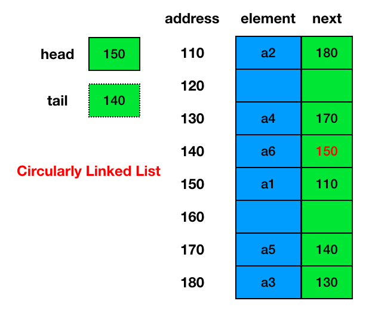

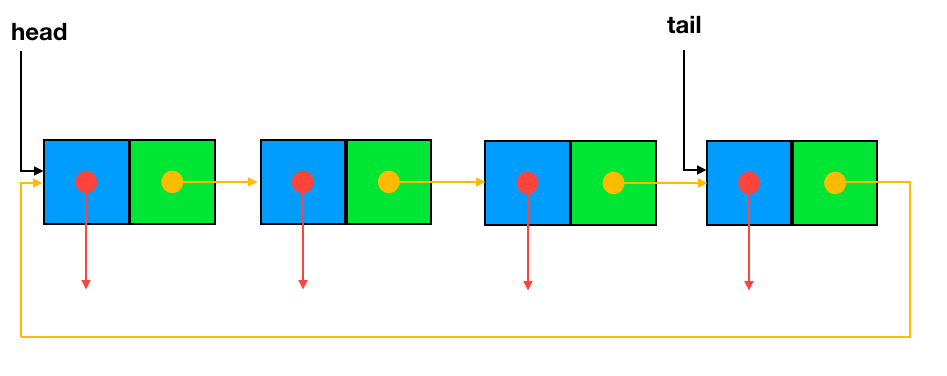

+ For `Singly Linked List` data structure, we use [SingleLinkedList class](https://replit.com/@ZhangNing1/CSCI241NingZhang#CSCI241/CircularlyLinkedList.java).

## 3.2.2 Operations
+ **traverse**: To traverse all the nodes one after another.
+ **insert**: To add a node at the given position.
+ **delete**: To delete a node.
+ **search**: To search an element(s) by value.
+ **update**: To update a node.
+ **sort**: To arrange nodes in a linked list in a specific order.(not covered in this topic)
+ **merge**: To merge two linked lists into one.

### 3.2.2.1 traverse
+ The idea here is to step through the list from beginning to end.
+ The algorithm for traversing a list
  - Start with the `head` of the list. Access the content of the `head` node if it is not null.
  - Then go to the `next` node(if exists) and access the node information
  - Continue until no more nodes (that is, you have reached the `head` node again)
### 3.2.2.2 insert
+ There can be three cases that will occur when we are inserting a node in a linked list.
  - Insertion before the head(insert as the new head)
  - Insertion after the tail (insert as the new tail, append)
  - Insertion after a given node or position
+ **Insertion before the head**
  - step 1: Allocate memory for `new node` and store data
  - step 2: Change `next` of `new node` to point to `head`
  - step 3: Change `head` to point to `new node`
  - step 4: Change `next` of `tail` to point to `head` (the extra step compared to singly linked list)

  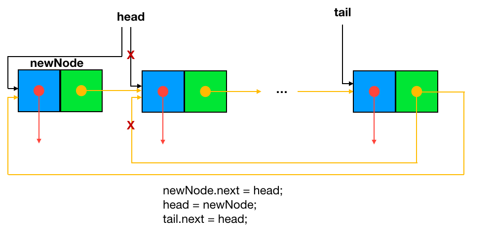
  
+ **Insertion after the tail**
  - step 1: Allocate memory for `new node` and store data
  - step 2: Traverse to last node(or use `tail` attribute)
  - step 3: Change `next` of last node to `new node`
  - step 4: change `tail` to point to `new node`
  - step 5: Change `next` of `tail` to point to `head` (the extra step compared to singly linked list)
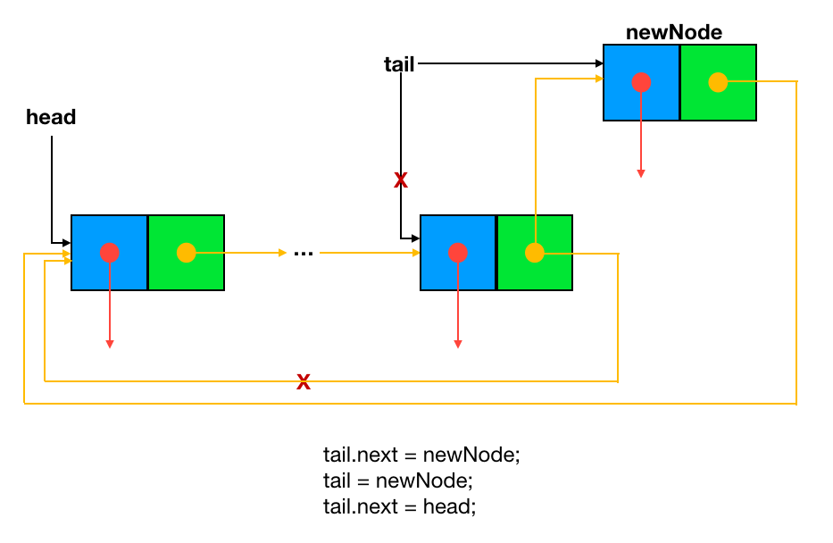

+ **Insertion after a node** (If the node is `tail`, use insertLast() method. Exactly the same as insertAfter() method in SinglyLinedList)
  - step 1: Allocate memory for `new node` and store data
  - step 2: Change `next` of `new node` to `next` of `previous node`
  - step 3: Change `next` of `previous node` to `new node`

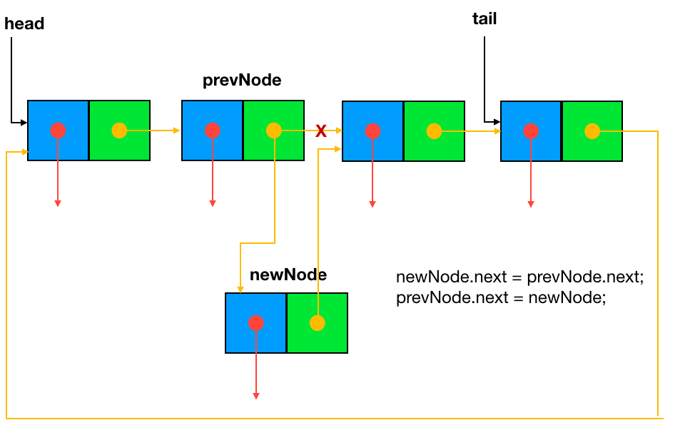

+ **Insert after a position**
  - step 1: Allocate memory for `new node` and store data
  - step 2: Traverse to node just before the required position of new node(e.g., if we need to insert a node after the 4th node, the key is to start from the `head` and find the 4th node or `next` of the 3rd node, then define it as `prevNode`)
  - step 3: follow the same steps(steps 2 and 3) in **Insertion after a node** operation

### 3.2.2.3 delete
+ To delete a node from a linked list, we need to do these steps
  - Deletion at the head
  - Deletion at the tail
  - Deletion at a given node or position

+ **Delete head**
  - step 1: Change `head` to point to `next` of `head`
  - step 2: Change `next` of`tail` to point to `head`

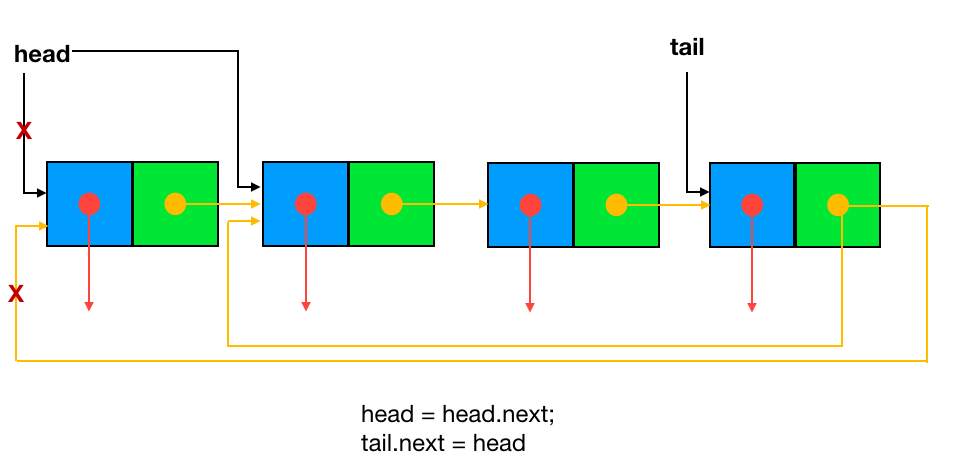

+ **Delete tail**
  - step 1: traverse to find `previous node` before `tail`
  - step 2: change `tail` to `previous node`
  - step 3: change `next` of new `tail` to `head`

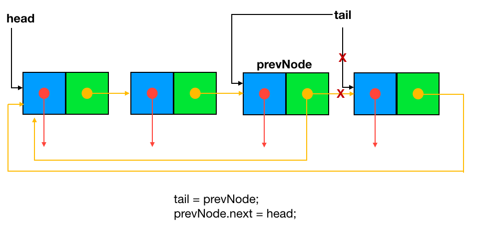

+ **Delete node**
  - step 1: traverse to find `previous node` before `delete node`
  - step 2: change `next` of `previous node` to `next` of `delete node`

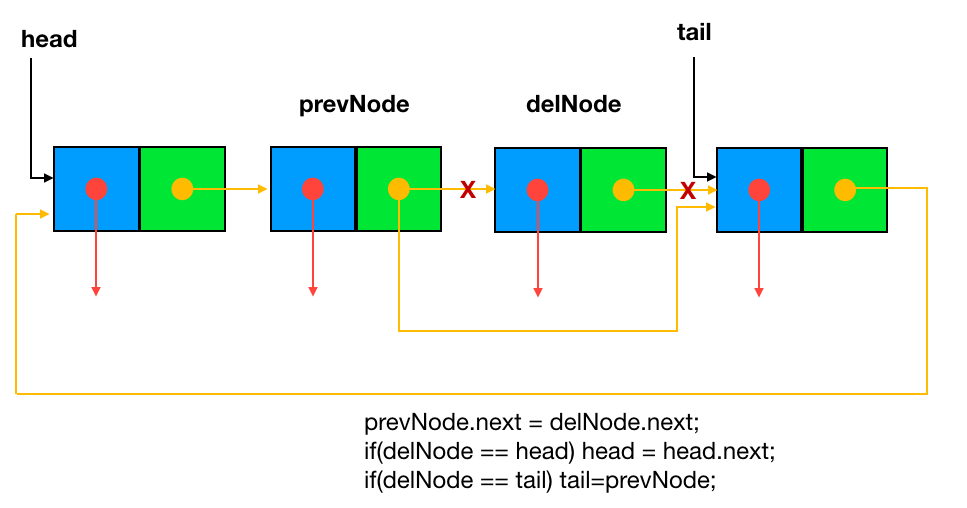

### 3.2.2.4 search
+ Traverse the list to compare the `element` of each node with the `key` value
+ Return `true` if the `key` matches `element`
+ Return `false` if no match in the entire list

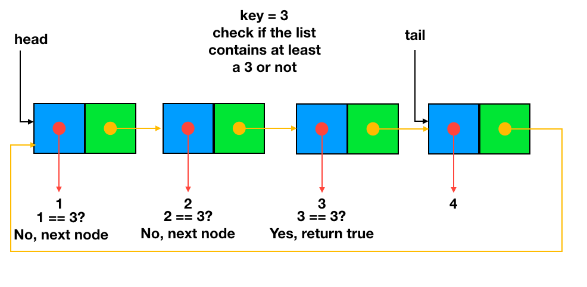

### 3.2.2.5 update

+ Update the first element with `key` value to `newValue`
+ Traverse the list to compare the `element` of each node with the `key` value
+ Update `element` to `newValue` if the `key` matches `element`

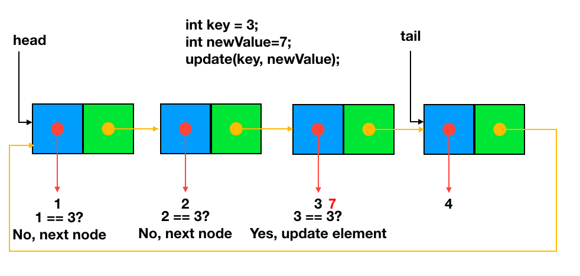

### 3.2.2.6 merge
+ change `next` of `tail` of the first list to `head` of the second list
+ change `tail` of the first list  to `tail` of the second list
+ change `tail` of the second list  to `head` of the first list

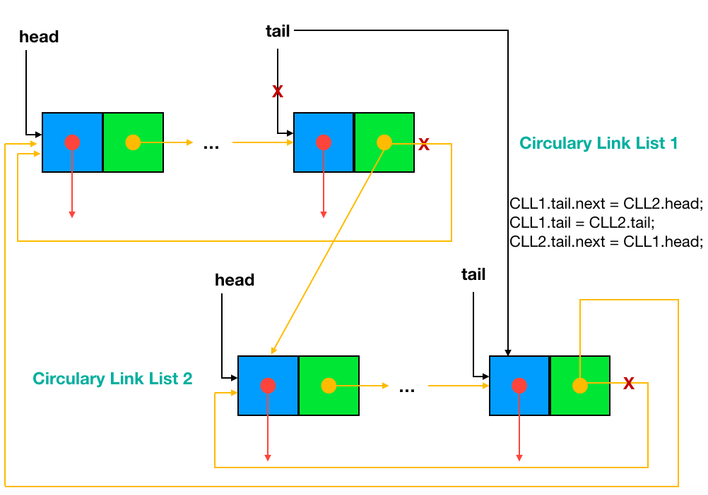
