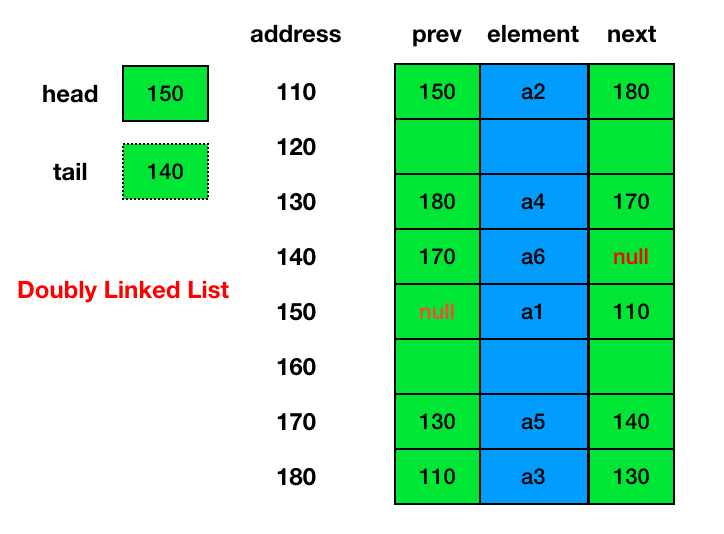
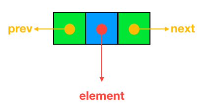
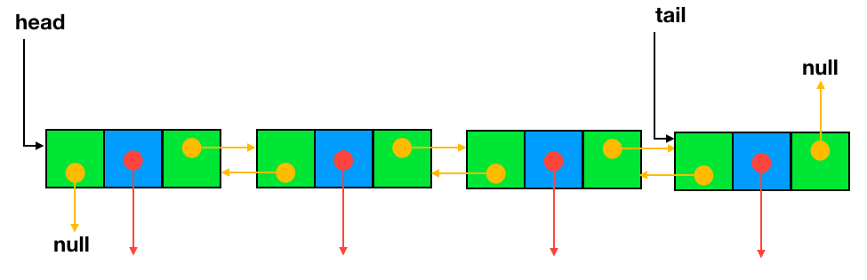
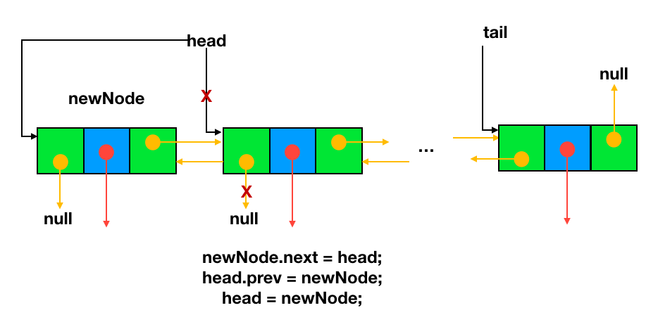
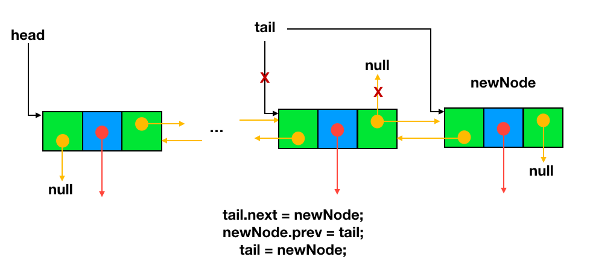
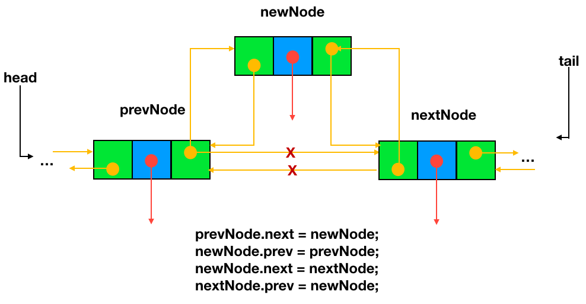
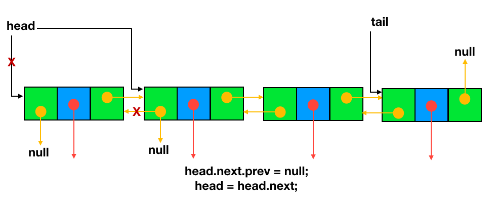
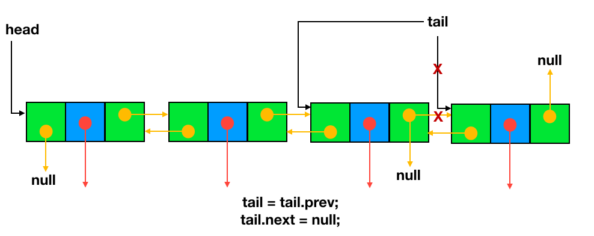
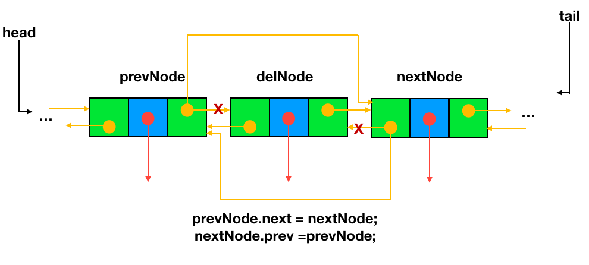

# 3.3 Doubly Linked Lists
## 3.3.1 Introduction
+ Doubly linked list is a complex type of linked list in which a node contains a pointer to the previous as well as the next node in the sequence. 
+ Therefore, in a doubly linked list, a node consists of three parts: node data, pointer to the next node in sequence (next pointer) , pointer to the previous node (previous pointer). 

+ Note that we do not use the two `dummy` nodes (see more details in the textbook) in our doubly linked list.

## 3.3.2 Operations
+ **traverse**: To traverse all the nodes one after another.
+ **insert**: To add a node at the given position.
+ **delete**: To delete a node.
+ **search**: To search an element(s) by value.
+ **update**: To update a node.
+ **sort**: To arrange nodes in a linked list in a specific order.(not covered in this topic)
+ **merge**: To merge two linked lists into one.

### 3.3.2.1 traverse
+ The idea here is to step through the list from beginning to end or from end to beginning.
+ The algorithm for traversing a list `from beginning to end`
  - Start with the head of the list. Access the content of the head node if it is not null.
  - Then go to the next node(if exists) and access the node information
  - Continue until no more nodes (that is, you have reached the null node)

+ The algorithm for traversing a list `from end to beginning`
  - Start with the tail of the list. Access the content of the tail node if it is not null.
  - Then go to the previous node(if exists) and access the node information
  - Continue until no more nodes (that is, you have reached the null node)

### 3.3.2.2 insert
+ There can be three cases that will occur when we are inserting a node in a linked list.
  - Insertion before the head(insert as the new head)
  - Insertion after the tail (insert as the new tail, append)
  - Insertion after a given node or position
+ **Insertion before the head**
  - step 1: Allocate memory for `new node` and store data
  - step 2: Change `next` of `new node` to point to `head` and `prev` of `head` to point to `new node`
  - step 3: Change `head` to point to `new node`

+ **Insertion after the tail**
  - step 1: Allocate memory for `new node` and store data
  - step 2: Traverse to last node(or use `tail` attribute)
  - step 3: Change `next` of `tail` to `new node` and `prev` of `new node` to `tail`
  - step 4: change `tail` to point to `new node`
 

+ **Insertion after a node**
  - step 1: Allocate memory for `new node` and store data
  - step 2: Change `next` of `new node` to `next` of `previous node` and  `next` of `previous node` to `new node`
  - step 3: Change `prev` of `new node` to `previous node` and prev` of `next node` to `new node` 

+ **Insert after a position**
  - step 1: Allocate memory for `new node` and store data
  - step 2: Traverse to node just before the required position of new node(e.g., if we need to insert a node after the 4th node, the key is to start from the `head` and find the 4th node or `next` of the 3rd node, then define it as `prevNode`)
  - step 3: follow the same steps(steps 2 and 3) in **Insertion after a node** operation
  
### 3.2.2.3 delete
+ To delete a node from a doubly linked list, we need to do these steps
  - Deletion at the head
  - Deletion at the tail
  - Deletion at a given node or position

+ **Delete head**
  - step 1: Change `prev` of the second node(`next` of `head`) to point to `null`
  - step 2: Change `head` to point to `next` of `head`

+ **Delete tail**
  - step 1: change `tail` to `prev` of `tail`(`previous node`)
  - step 1: change `next` of new `tail` to `null`

+ **Delete node**
  - step 1: change `next` of `previous node` to `next` of `delete node`
  - step 2: change `prev` of `next node` to `prev` of `delete node`

