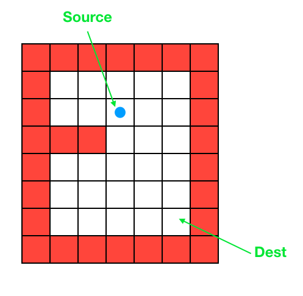

# 1. Tower of Hanoi
# 1.1 Game Description
Tower of Hanoi is a mathematical puzzle where we have three rods (`A`, `B`, and `C`) and `N` disks. Initially, all the disks are stacked in decreasing value of diameter i.e., the smallest disk is placed on the top and they are on rod `A`. The objective of the puzzle is to move the entire stack to another rod (here considered `C`), obeying the following simple rules:
+ Only one disk can be moved at a time.
+ Each move consists of taking the upper disk from one of the stacks and placing it on top of another stack i.e. a disk can only be moved if it is the uppermost disk on a stack.
+ No disk may be placed on top of a smaller disk.

## 1.2 Examples:
[Play the game here](https://www.mathplayground.com/logic_tower_of_hanoi.html)

~~~~
Input: 2
Output: 
Disk 1 moved from A to B
Disk 2 moved from A to C
Disk 1 moved from B to C
~~~~

~~~~
Input: 3
Output: 
Disk 1 moved from A to C
Disk 2 moved from A to B
Disk 1 moved from C to B
Disk 3 moved from A to C
Disk 1 moved from B to A
Disk 2 moved from B to C
Disk 1 moved from A to C
~~~~

## 1.3 Tower of Hanoi using Recursion:
The idea is to use the helper node/auxiliary rod to reach the destination using recursion. Below is the pattern for this problem:
+ Shift `N-1` disks from `A` to `B`, using `C`.
+ Shift last disk from `A` to `C`.
+ Shift `N-1` disks from `B` to `C`, using `A`.

Follow the steps below to solve the problem:
+ Create a function `towerOfHanoi` where pass the `N` (current number of disk), `from_rod`, `to_rod`, `aux_rod`.
+ Call `towerOfHanoi` to move the top `N – 1` disks from `from_rod` to `aux_rod`.
+ Move the last (Nth) disk  from `from_rod` to `to_rod`.
+ Call `towerOfHanoi` to move the `N – 1` disks from `aux_rod` to `to_rod`.

[See code here](https://replit.com/@ZhangNing1/CSCI241NingZhang#CSCI241L/Hanoi.java)

# 2. Maze
# 2.1 Game Description

+ A Maze is given as `M*N` matrix of blocks.
+ Source block is at `maze[i][j]` and destination block is at `maze[M-2][N-2]`. 
+ We need to find a path from source to the destination. 
+ We can move in four directions: left, right, up and down.

## 2.2 Maze using Recursion:
The idea is to suppose there exists a path from the current position (i,j) to the destination. Then move 
+ down (test if there exists a path from position (i+1,j) to the destination)
+ right (test if there exists a path from position (i,j+1) to the destination)
+ up (test if there exists a path from position (i-1,j) to the destination)
+ left (test if there exists a path from position (i,j-1) to the destination)

Follow the steps below to solve the problem:
+ Create a function `isTherePath` where pass the `maze` (a 2d array to represent the maze), `i`, `j`.
+ if we have reached the destination(found the path), return true
+ else we move in different directions.

[See code here](https://replit.com/@ZhangNing1/CSCI241NingZhang#CSCI241L/Maze.java)
