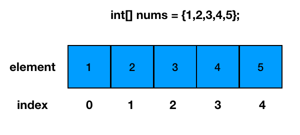
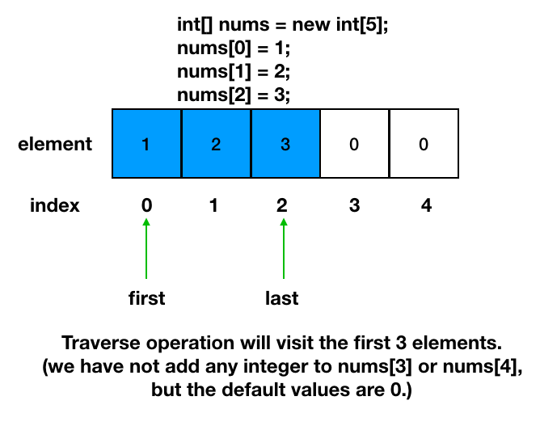
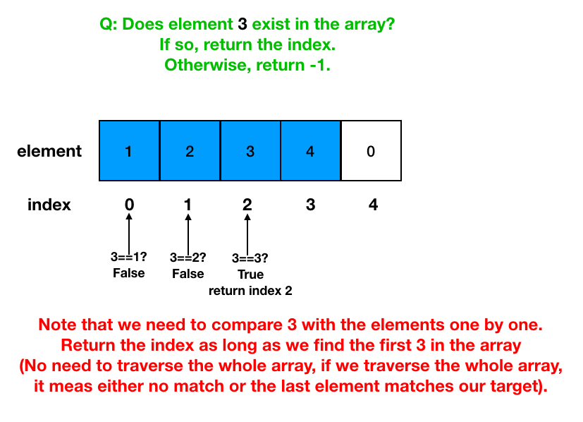
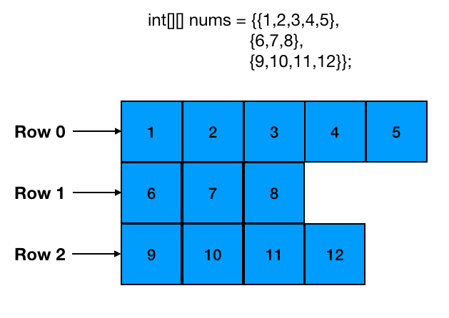
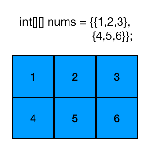
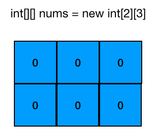
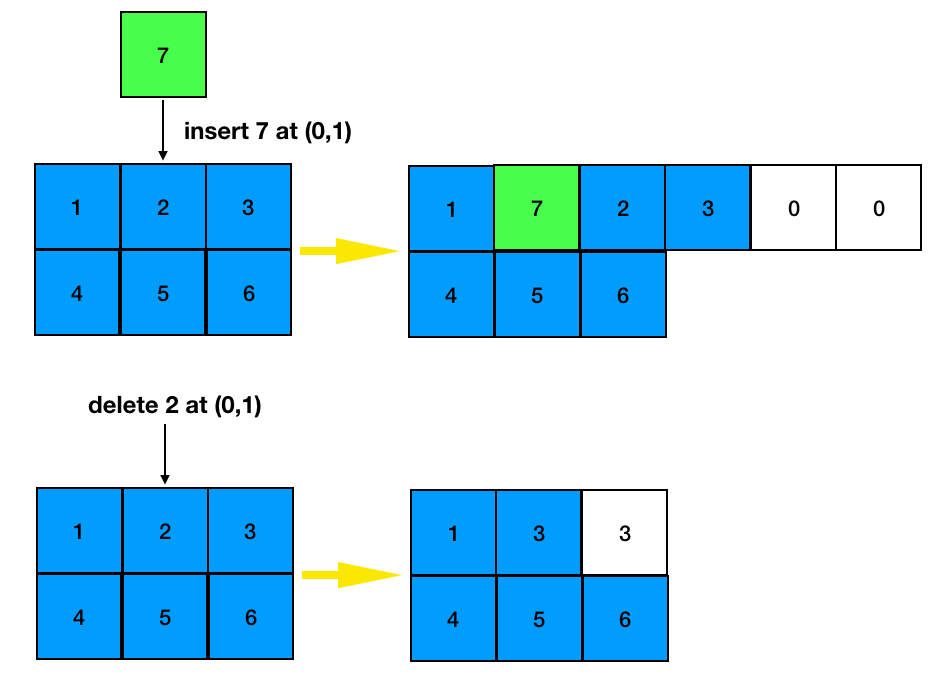
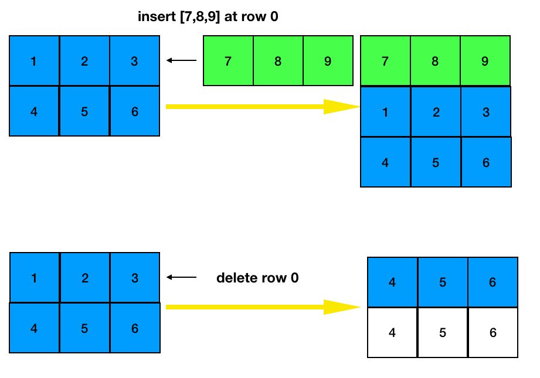
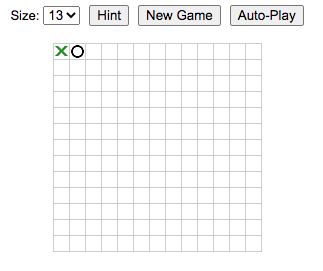
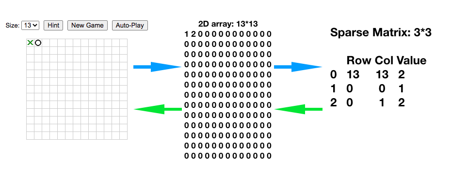

# CSCI241: Data Structures and Algorithms
# Dr. Ning Zhang
# Topic 2: Arrays
+ One dimensional arrays(section 3.1 in textbook)
+ Two dimensional arrays
+ Sparse matrices

# 2.1 One dimensional arrays
## 2.1.1 Introduction
+ Array is a container which can hold a fix number of items and these items should be of the same type.
+ Following are the important terms to understand the concept of Array.
  - **Element** − Each item stored in an array is called an element.
  - **Index** − Each location of an element in an array has a numerical index, which is used to identify the element.
  

+ As per the above illustration, following are the important points to be considered.
  - Index starts with 0.
  - Array length is 10 which means it can store 10 elements.
  - Each element can be accessed via its index. For example, we can fetch an element at index 6 as 27.
  
## 2.1.2 Basic Operations
+ Following are the basic operations supported by an array.
  - **Traverse** − print all the array elements one by one.
  - **Insert** − Add an element at the given index.
  - **Delete** − Delete an element at the given index.
  - **Search** − Search an element using the given index or by the value.
  - **Update** − Update an element at the given index.
  - **Sort** - Sort elements in order(we will learn this in later topics).
+ For the following subsections 2.1.2.1 - 2.1.2.7, we use [OneDimensionalArray class](https://replit.com/@ZhangNing1/CSCI241NingZhang#CSCI241/OneDimensionalArray.java) as an example. You can also see the [ScoreBoard](https://replit.com/@ZhangNing1/CSCI241NingZhang#dsaj/arrays/Scoreboard.java) example provided by the textbook.
### 2.1.2.1 Create an array
+ Method 1: Use an assignment to a literal
  - Syntax: The elementType can be any Java base type or class name, and arrayName can be any valid Java identifier. The initial values must be of the same type as the array.
  ~~~~
  elementType[] arrayName = {initialValue0, initialValue1, ..., initialValueN-1};
  ~~~~
  - Example
  ~~~~
  int[] nums = {1,2,3,4,5};
  ~~~~
  
  
  
+ Method 2: **new** operator
  - Syntax: **length** is a positive integer denoting the length of the array. The **new** opeartor returns a reference to the new array, and typically this would be assigned to an array variable.
  ~~~~
  elementType[] arrayName = new elementType[length];
  ~~~~
  - Example:
  ~~~~
  int[] nums = new int[5];
  ~~~~
  
 
    
### 2.1.2.2 Traverse an array
+ Array traversal: processing each array element sequentially from the first to the last.
  - Q: How could we define `the last`?
  - A: In our class, we use the last item we added into the array(the `size` attribute in `OneDimensionalArray` class).
~~~~
for(i=0; i<array.size; i++){
  do something with array[i];
}
~~~~

### 2.1.2.3 Insert a new element
+ The new element is inserted between the existing elements.

+ Some special cases

  
### 2.1.2.4 Delete an element

### 2.1.2.5 Search an element

### 2.1.2.6 Update an element

### 2.1.2.7 Sort an array
+ We will learn different **sorting** algrithms later. Currently, let's use the built-in method provide by Java.
+ Example
~~~~~
int[] nums = {3,2,1,5,4};
java.util.Arrays.sort(nums);
~~~~~

# 2.2 Two Dimensional Arrays

## 2.2.1 Introduction
+ 2D array can be defined as an array of arrays.
+ 2D array is organized as matrices which can be represented as the collection of rows and columns.
+ 2D arrays are created to implement a relational database look alike data structure. It provides ease of holding bulk of data at once which can be passed to any number of functions wherever required.
+ Note that In Java, the number of elements in each row could be different. For example, the following 2D array is valid in Java. But let's focus on 2D arrays with the same width.

## 2.2.2 Basic Operations
+ Following are the basic operations supported by an array.(Note that you can add more operations based on specific requirements. For example, if you need to use 2d array as the model of matrices in mathematics, then you need to provide operations like matrix addition, subtraction, multiplication, transpose, etc. You can also change the size by **Insert**(Add a row or a column or an element at the given index) or **Delete**(Delete a row or a column or an element at the given index). In this example, let's focus on some simple operations that will not change the size of the array.
  - **Traverse** − print all the array elements one by one.
  - **Search** − Search an element using the given position or by the value.
  - **Update** − Update an element at the given position.
+ For the following subsections 2.2.2.1 - 2.2.2.6, we use [TwoDimensionalArray class](https://replit.com/@ZhangNing1/CSCI241NingZhang#CSCI241/TwoDimensionalArray.java) as an example.
### 2.2.2.1 Create a 2d array
+ Method 1: Use an assignment to a literal
  - Syntax
  ~~~~
  elementType[][] arrayName = {{one dimensional array 1}, {one dimensional array 2}, ... ,{one dimensional array N-1}};
  ~~~~
  - Example
  ~~~~
  int[][] nums = {{1,2,3},{4,5,6}};
  ~~~~
  
  
  
+ Method 2: **new** operator
  - Syntax: **length** is a positive integer denoting the length of the array. The **new** opeartor returns a reference to the new array, and typically this would be assigned to an array variable.
  ~~~~
  elementType[][] arrayName = new elementType[height][width];
  ~~~~
  - Example:
  ~~~~
  int[][] nums = new int[2][3];
  ~~~~
  
 
 
### 2.2.2.2 Traverse
+ Note in this 2D array example, we simply use a nested loop to visit all the elements.
+ [Row-Major Order vs. Column-Major Order](https://www.codecademy.com/learn/learn-java/modules/java-two-dimensional-arrays/cheatsheet)
+ [In Java, it is similar to row-major order, but it's not quite the same thing](https://stackoverflow.com/questions/6630990/java-a-two-dimensional-array-is-stored-in-column-major-or-row-major-order#:~:text=Consequently%2C%20Java%20is%20neither%20column,separate%2C%20unrelated%20blocks%20of%20memory.)
~~~~
for(i=0; i<array.height; i++){
  for(j=0; j<array.width;j++)
  do something with array[i][j];
}
~~~~

### 2.2.2.2 Search an element
+ We use a nested loop to compare each element with the target value, return its position( row_index, col_index.)
+ How to define the position of an element in a 2d array?
  - an array of two integers(we use this method in our example)
  - a class

~~~~
for(i=0; i<array.height; i++){
  for(j=0; j<array.width;j++)
  if array[i][j]==value
    return i and j
}
~~~~
### 2.2.2.2 Update an element
+ To update an element, we need the following syntax.

~~~~
2darray_name[row_index][col_index] = new_value;
~~~~

+ Of course,we need to consider the `IndexOutOfBoundsException` exception.

### 2.2.2.3 Insert and Delete
+ We are not going to learn the implementation of these two methods in Java code.
+ But either inserting/deleting an element or a row/column is feasible in Java. You can try to implement those methods in [TwoDimensionalArray class](https://replit.com/@ZhangNing1/CSCI241NingZhang#CSCI241/TwoDimensionalArray.java)

# 2.3 Sparse Matrix
## 2.3.1 One application: Gomoku/Five-in-a-row
+ [Game Introduction](https://en.wikipedia.org/wiki/Gomoku)
+ Online Gomoku:[Link 1](https://www.mathsisfun.com/games/gomoku.html) and [Link 2](http://www.javascripter.net/games/xo/xo.htm).
+ Suppose one requirement: save the game to finishi play later

 
 
+ We can store the current state of the game into a 2D array

~~~~
1 2 0 0 0 0 0 0 0 0 0 0 0
0 0 0 0 0 0 0 0 0 0 0 0 0
0 0 0 0 0 0 0 0 0 0 0 0 0
0 0 0 0 0 0 0 0 0 0 0 0 0
0 0 0 0 0 0 0 0 0 0 0 0 0
0 0 0 0 0 0 0 0 0 0 0 0 0
0 0 0 0 0 0 0 0 0 0 0 0 0
0 0 0 0 0 0 0 0 0 0 0 0 0
0 0 0 0 0 0 0 0 0 0 0 0 0
0 0 0 0 0 0 0 0 0 0 0 0 0
0 0 0 0 0 0 0 0 0 0 0 0 0
0 0 0 0 0 0 0 0 0 0 0 0 0
0 0 0 0 0 0 0 0 0 0 0 0 0
~~~~

+ One problem: too many `meaningless` information(0's) in the 2D array.
+ Solution: **sparse matrix**
  - When most of the elements in an array are 0's or the same value, we can use a sparese array to store the information.
  - How to store the information?
    + number of rows, number of columns, number of non-zero elements
    + non-zero elements in a smaller array
   
+ One example
  - number of rows, number of columns, number of non-zero elements: first row in sparese matrix -> 5,6,6
  - non-zero elements in a smaller array: row 2 to row 7
  - 30(5\*6) integers -> 21(3\*7) integers

+ For our game

~~~~
    Row Col Value
0   13  13  2
1   0   0   1
2   0   1   2
~~~~

## 2.3.2 2D array to sparse matrix
+ Step 1: traverse 2D array to get the number of non-zero elements: **sum** (suppose we use a variable named sum to store the number of non-zeros).
+ Step 2: create sparese matrix: `sparseArr = new int[sum+1][3]`.
  - row number = sum + 1
  - column number = 3 (always)
+ Step 3: save non-zero elements into sparse matrix.

## 2.3.2  sparse matrix to 2D array
+ Step 1: read the first row from sparse matrix, create 2D array according to the numbers of rows and columns. E.g., `chessArr = new int[13][13]`.
+ Step 2: read the other rows from sparse matrix, assign non-zeros to 2D array.

## 2.3.3 more operations
+ Save the spare matrix as a file on the hard disk.
+ Read the file stroed on the hard disk and recover the spare matrix and 2D array.
+ You can try to implement these operations after class.
# References
[2D Array JavaPoint](https://www.javatpoint.com/data-structure-2d-array)
