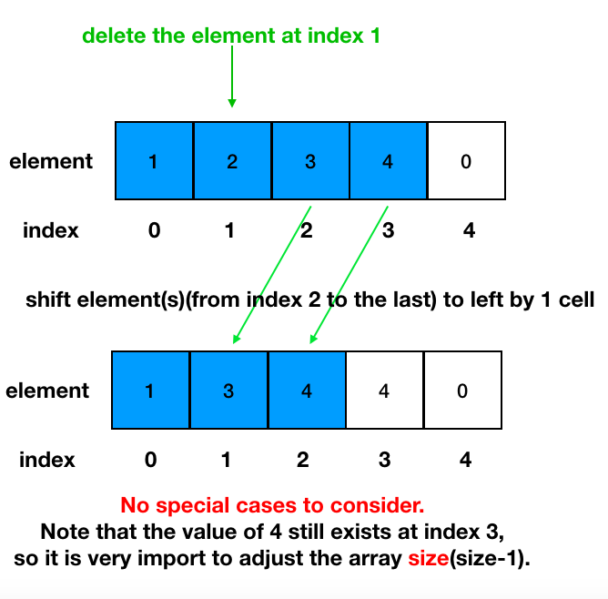

# CSCI241: Data Structures and Algorithms
# Dr. Ning Zhang
# Topic 2: Arrays
+ One dimensional arrays(section 3.1 in textbook)
+ Two dimensional arrays
+ Sparse matrices

# 2.1 One dimensional arrays
## 2.1.1 Introduction
+ Array is a container which can hold a fix number of items and these items should be of the same type.
+ Following are the important terms to understand the concept of Array.
  - **Element** − Each item stored in an array is called an element.
  - **Index** − Each location of an element in an array has a numerical index, which is used to identify the element.
  

+ As per the above illustration, following are the important points to be considered.
  - Index starts with 0.
  - Array length is 10 which means it can store 10 elements.
  - Each element can be accessed via its index. For example, we can fetch an element at index 6 as 27.
  
## 2.1.2 Basic Operations
+ Following are the basic operations supported by an array.
  - **Traverse** − print all the array elements one by one.
  - **Insert** − Add an element at the given index.
  - **Delete** − Delete an element at the given index.
  - **Search** − Search an element using the given index or by the value.
  - **Update** − Update an element at the given index.
  - **Sort** - Sort elements in order(we will learn this in later topics).
+ For the following subsections 2.1.2.1 - 2.1.2.7, we use [OneDimensionalArray class](https://replit.com/@ZhangNing1/CSCI241NingZhang#CSCI241/OneDimensionalArray.java) as an example. You can also see the [ScoreBoard](https://replit.com/@ZhangNing1/CSCI241NingZhang#dsaj/arrays/Scoreboard.java) example provided by the textbook.
### 2.1.2.1 Create an array
+ Method 1: Use an assignment to a literal
  - Syntax: The elementType can be any Java base type or class name, and arrayName can be any valid Java identifier. The initial values must be of the same type as the array.
  ~~~~
  elementType[] arrayName = {initialValue0, initialValue1, ..., initialValueN-1};
  ~~~~
  - Example
  ~~~~
  int[] nums = {1,2,3,4,5};
  ~~~~
  
  
  
+ Method 2: **new** operator
  - Syntax: **length** is a positive integer denoting the length of the array. The **new** opeartor returns a reference to the new array, and typically this would be assigned to an array variable.
  ~~~~
  elementType[] arrayName = new elementType[length];
  ~~~~
  - Example:
  ~~~~
  int[] nums = new int[5];
  ~~~~
  
 
    
### 2.1.2.2 Traverse an array
+ Array traversal: processing each array element sequentially from the first to the last.
  - Q: How could we define `the last`?
  - A: In our class, we use the last item we added into the array(the `size` attribute in `OneDimensionalArray` class).
~~~~
for(i=0; i<array.size; i++){
  do something with array[i];
}
~~~~

### 2.1.2.3 Insert a new element
+ The new element is inserted between the existing elements.

+ Some special cases

  
### 2.1.2.4 Delete an element

### 2.1.2.5 Search an element

### 2.1.2.6 Update an element

### 2.1.2.7 Sort an array
+ We will learn different **sorting** algrithms later. Currently, let's use the built-in method provide by Java.
+ Example
~~~~~
int[] nums = {3,2,1,5,4};
java.util.Arrays.sort(nums);
~~~~~

# 2.2 Two Dimensional Arrays

## 2.2.1 Introduction
+ 2D array can be defined as an array of arrays.
+ 2D array is organized as matrices which can be represented as the collection of rows and columns.
+ 2D arrays are created to implement a relational database look alike data structure. It provides ease of holding bulk of data at once which can be passed to any number of functions wherever required.

## 2.1.2 Basic Operations
+ Following are the basic operations supported by an array.(Note that you can add more operations based on specific requirements. For example, if you need to use 2d array as the model of matrices in mathematics, then you need to provide operations like matrix addition, subtraction, multiplication, transpose, etc. )
  - **Traverse** − print all the array elements one by one.
  - **Insert** − Add an element at the given index.
  - **Delete** − Delete an element at the given index.
  - **Search** − Search an element using the given index or by the value.
  - **Update** − Update an element at the given index.
+ For the following subsections 2.2.2.1 - 2.2.2.6, we use [TwoDimensionalArray class](https://replit.com/@ZhangNing1/CSCI241NingZhang#CSCI241/TwoDimensionalArray.java) as an example.
### 2.1.2.1 Create a 2d array
+ Method 1: Use an assignment to a literal
  - Syntax
  ~~~~
  elementType[][] arrayName = {{one dimensional array 1}, {one dimensional array 2}, ... ,{one dimensional array N-1}};
  ~~~~
  - Example
  ~~~~
  int[][] nums = {{1,2,3},{4,5,6}};
  ~~~~
  
  
  
+ Method 2: **new** operator
  - Syntax: **length** is a positive integer denoting the length of the array. The **new** opeartor returns a reference to the new array, and typically this would be assigned to an array variable.
  ~~~~
  elementType[][] arrayName = new elementType[height][width];
  ~~~~
  - Example:
  ~~~~
  int[][] nums = new int[2][3];
  ~~~~
  
 
 
# References
[2D Array JavaPoint](https://www.javatpoint.com/data-structure-2d-array)
