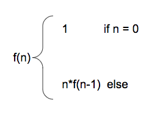
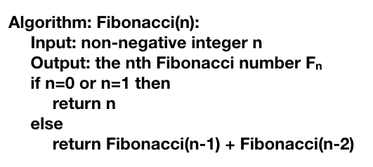
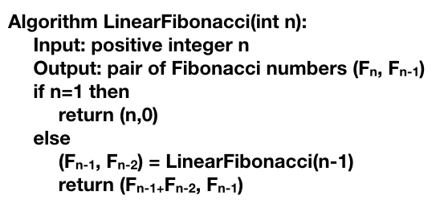

# CSCI 241
# Topic 5: Recursion

# 1. The Recursion Pattern
+ `Recursion`: The process in which a function calls itself directly or indirectly is called recursion and the corresponding function is called a recursive function.
+ Using a recursive algorithm, certain problems can be solved quite easily. Examples of such problems are `Towers of Hanoi (TOH)`, `Inorder/Preorder/Postorder Tree Traversals`, `DFS of Graph`, etc.
+ A recursive function solves a particular problem by calling a copy of itself and solving smaller subproblems of the original problems. 
+ Recursion is an amazing technique with the help of which we can reduce the length of our code and make it easier to read and write. It has certain advantages over the iteration technique which will be discussed later. A task that can be defined with its similar subtask, recursion is one of the best solutions for it. For example; The Factorial of a number.
+ Classic example – the factorial function:
~~~~
n! = n*(n-1)*(n-2)*....*2*1
~~~~

+ Recursive definition:

# 2. Content of a Recursion Method

+ Base case(s):
  - Values of the input variables for which we perform no recursive calls are called base cases (there should be at least one base case).
  - Every possible chain of recursive calls must eventually reach a base case.
+ Recursive calls
  - calls to the recursive method
  - each recursive call should be defined so that it makes progress towards a base case.
+ Visualizing Recursion
  - A box for each recursive call
  - An arrow from each caller to callee
  - An arrow from each callee to caller showing return value
  

# 3. Binary search
+ Search for an integer in an ordered array.
+ We consider four cases:
  - If `low` > `high`, then we could not found the `target`.
  - If `target` equals `data[mid]`, then we have found the `target`.
  - If `target` < `data[mid]`, then we recur on the first half of the sequence.
  - If `target` > `data[mid]`, then we recur on the second half of the sequence.

+ Base cases:
  - `low > high`
  - `target == data[mid]`
+ Recursive calls
  - `target` < `data[mid]
  - `target` > `data[mid]`

+ Analyze binary search
  - Each recursive call divides the search region  in half. Hence, there can be at most `log(n)` levels.(We will learn the details in next topic)
# 4. Linear Recursion vs. Binary Recursion
## 4.1 Linear Recursion
+ Test for base cases
  - Begin by testing for a set of base cases(at least one)
  - Every possible chain of recursive calls must eventually reach a base case, and the handling of each base case should not use  recursion.
+ Recur once
  - Perform a single recursive call
  - This step may have a test that decides which of several possible recursive calls to make. But it should ultimately make just one of these calls.
  - Define each possible recursive call so that it makes progress towards a base case.
## 4.2 Binary Recursion
+ Binary recursion occurs whenever there a recursive calls for each non-base case.

# 5. Fibonacci Numbers
+ Fibonacci numbers are defined recursively:

+ Recursive algorithm(binary recursive method)

# 6. Advantages of Recursion
+ Recursion provides a clean and simple way to write code.
+ Some problems are inherently recursive like tree traversals, Tower of Hanoi, etc. For such problems, it is preferred to write recursive code.

# 7. Disadvantages of Recursion
+ The recursive program has greater space requirements as all functions will remain in the stack until the base case is reached.
+ It also has greater time requirements because of function calls and returns overhead.
+ Moreover, due to the smaller length of code, the codes are difficult to understand and hence extra care has to be practiced while writing the code. The computer may run out of memory if the recursive calls are not properly checked.

# 8. A better Fibonacci Algorithm: linear recursion

# 8. Designing Recursive Algorithms
An algorithm that uses recursion typically has the following form:
+ `Test for base cases`. We begin by testing for a set of base cases (there should be at least one). These base cases should be defined so that every possible chain of recursive calls will eventually reach a base case, and the handling of each base case should not use recursion.
+ `Recur`. If not a base case, we perform one or more recursive calls. This recur- sive step may involve a test that decides which of several possible recursive calls to make. We should define each possible recursive call so that it makes progress towards a base case.

In our lab this Friday, We will use the application of `Tower of Hanoi` as an example to show you how to design a recursive algorithm.
