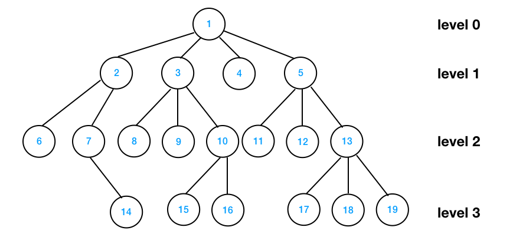
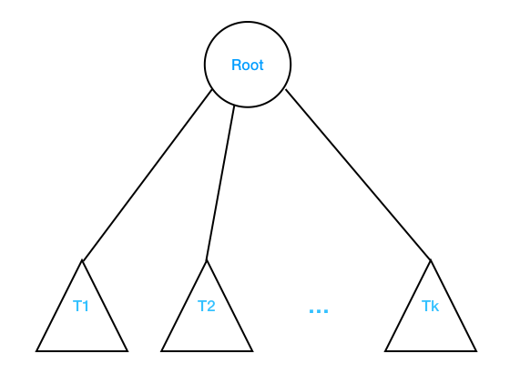

# CSCI 241
# Topic 7: Trees
# 7.1 Definition of trees
## What is a Tree data structure?
+ A tree is non-linear and a hierarchical data structure consisting of a collection of nodes such that each node of the tree stores a value and a list of references to other nodes (the “children”).
+ This data structure is a specialized method to organize and store data in the computer to be used more effectively.
+ It consists of a central node, structural nodes, and sub-nodes, which are connected via edges.
+ We can also say that tree data structure has `root`, `branches`, and `leaves` connected with one another. 

### Formal Definition of Tree
+ Formally, we define a `tree T` as a set of `nodes` storing elements such that the nodes have a `parent-child` relationship that satisfies the following properties:
  - If T is nonempty, it has a special node, called the `root` of T , that has no parent.
  - Each node v of T different from the root has a unique `parent` node w; every node with parent w is a `child` of w.
+ Note that according to our definition, a tree can be empty, meaning that it does not have any nodes. This convention also allows us to define a tree recursively such that a tree T is either empty or consists of a node r, called the root of T, and a (possibly empty) set of subtrees whose roots are the children of r.

## Recursive Definition: 
+ A tree consists of a root, and zero or more subtrees T1, T2, … , Tk such that there is an edge from the root of the tree to the root of each subtree.

## Why Tree is considered a non-linear data structure?
The data in a tree are not stored in a sequential manner i.e, they are not stored linearly. Instead, they are arranged on multiple levels or we can say it is a hierarchical structure. For this reason, the tree is considered to be a non-linear data structure.

## Why do we use trees?
Trees can be applied to many things. The hierarchical structure gives a tree unique properties for storing, manipulating, and accessing data. Trees form some of the most basic organization of computers. We can use a tree for the following:
+ **Storage as hierarchy**. Storing information that naturally occurs in a hierarchy. File systems on a computer and PDF use tree structures.
+ **Searching**. Storing information that we want to search quickly. Trees are easier to search than a Linked List. Some types of trees (like AVL and Red-Black trees) are designed for fast searching.
+ **Inheritance**. Trees are used for inheritance, XML parser, machine learning, and DNS, amongst many other things.
+ **Indexing**. Advanced types of trees, like B-Trees and B+ Trees, can be used for indexing a database.
+ **Networking**. Trees are ideal for things like social networking and computer chess games.
+ **Shortest path**. A Spanning Tree can be used to find the shortest paths in routers for networking.

## Basic Terminologies in Tree Data Structure:
+ **Root Node**: The topmost node of a tree or the node which does not have any parent node is called the root node. {1} is the root node of the tree. A non-empty tree must contain exactly one root node and exactly one path from the root to all other nodes of the tree.
+ **Parent Node**: The node which is a predecessor of a node is called the parent node of that node. Examples: {2} is the parent node of {6, 7}.
+ **Child Node**: The node which is the immediate successor of a node is called the child node of that node. Examples: {6, 7} are the child nodes of {2}.
+ **Leaf Node** or **External Node**: The nodes which do not have any child nodes are called leaf nodes. {6, 14, 8, 9, 15, 16, 4, 11, 12, 17, 18, 19} are the leaf nodes of the tree.
+ **Ancestor of a Node**: Any predecessor nodes on the path of the root to that node are called Ancestors of that node. {1, 2} are the ancestor nodes of the node {7}
+ **Descendant**: Any successor node on the path from the leaf node to that node. {7, 14} are the descendants of the node. {2}.
+ **Sibling**: Children of the same parent node are called siblings. {8, 9, 10} are called siblings.
+ **Level of a node**: The count of edges on the path from the root node to that node. The root node has level 0.
+ **Internal node**: A node with at least one child is called Internal Node.
+ **Neighbour of a Node**: Parent or child nodes of that node are called neighbors of that node.
+ **Subtree**: Any node of the tree along with its descendant.

## Properties of a Tree:
+ **Number of edges**: An edge can be defined as the connection between two nodes. If a tree has N nodes then it will have (N-1) edges. There is only one path from each node to any other node of the tree.
+ **Depth of a node**: The depth of a node is defined as the length of the path from the root to that node. Each edge adds 1 unit of length to the path. So, it can also be defined as the number of edges in the path from the root of the tree to the nod
+ **Height of a node**: The height of a node can be defined as the length of the longest path from the node to a leaf node of the tree.
+ **Height of the Tree**: The height of a tree is the length of the longest path from the root of the tree to a leaf node of the tree.
+ **Degree of a Node**: The total count of subtrees attached to that node is called the degree of the node. The degree of a leaf node must be 0. The degree of a tree is the maximum degree of a node among all the nodes in the tree.

+ Some more properties are:
  - Traversing in a tree is done by depth first search and breadth first search algorithm.
  - It has no loop and no circuit
  - It has no self-loop 
  - Its hierarchical model.

### Ordered Trees

+ A tree is `ordered` if there is a meaningful linear order among the children of each node; that is, we purposefully identify the children of a node as being the first, second, third, and so on. Such an order is usually visualized by arranging siblings left to right, according to their order.

## 7.2 General Trees

[General Trees](generaltrees.md)

## 7.3 Binary Trees

[binary Trees](binarytrees.md)

