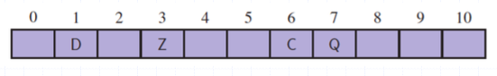
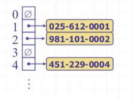
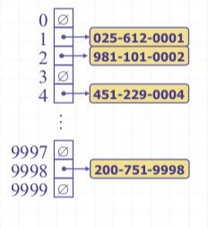

# CSCI241
# Topic 8: Maps and Hash Tables
# 8.1 Maps
+ A Map is an abstract data structure (ADT)
  - it  stores key-value (k,v) pairs 
  - there cannot be duplicate keys 

+ Maps are useful in situations where a key can be viewed as a unique identifier for the object
  - the key is used to decide where to store the object in the structure.  In other words,  the key associated with an object can be viewed as the address for the object 
  - maps are sometimes called associative arrays

+ Note: Maps provide an alternative approach to searching

## Map ADT/Operations
+ size()
+ isEmpty()
+ get(k):if M contains an entry with key k, return it; else return null(this can be viewed as searching for key k)
+ put(k,v):
  - if M does not have an entry with key k,  add entry (k,v) and return null
  - else replace existing value of entry with v  and return the old value
  - (this can be viewed as inserting key k)
+ remove(k): remove entry (k,\*) from M (this can be viewed as deleting key k)

## Map example
**(k,v)   key=integer, value=letter**
~~~~~
              M={}
put(5,A)      M={(5,A)}
put(7,B)      M={(5,A), (7,B)}
put(2,C)      M={(5,A), (7,B), (2,C)}
put(8,D)      M={(5,A), (7,B), (2,C), (8,D)}
put(2,E)      M={(5,A), (7,B), (2,E), (8,D)}
get(7)        return B
get(4)        return null
get(2)        return E
remove(5)     M={(7,B), (2,E), (8,D)}
remove(2)     M={(7,B), (8,D)}
get(2)        return null
~~~~~

## Map Implemention
+ Arrays (Vector, ArrayList)
+ **Linked-list**
+ Binary search trees
+ Hash tables

## A LinkedList implementation of Maps
+ store the (k,v) pairs in a doubly linked list
+ get(k): hop through the list until find the element with key k
+ put(k,v):
  - find Node x with key k
  - if (x != null), replace the value in x with v
  - else create a new node(k,v) and add it at the front/end

+ remove(k)
  - find Node x with key k
  - f (x == null)  return null
  - else remove node x from the list and return the value
  - Note: why doubly-linked? need to delete at an arbitrary position
+ Analysis: 
  - Linked-list: 
    + put:  O(1) since we can add the new item at the begining or the end of the sequence.
    + get and remove: O(n)
    + the unsorted list implementation is effective only for maps of small size or maps in which puts are the most common operations, while searches and removals are rarely performed.
  - Hash tables: we’ll see that (under some assumptions)  search, insert, delete:  O(1)

# 8.2 Hash Tables/Hashing
+ A completely different approach to searching from the comparison-based methods (binary search, binary search trees)
+ rather than navigating through a dictionary data structure comparing the search key with the elements,  hashing tries to reference an element in a table directly based on its key
+ hashing transforms a key into a table address

## Intuitive Notion of a Map
+ Intuitively, a map M supports the abstraction of using keys as indices with a syntax suck as `M[k]`.
+ As a mental warm-up, consider a restricted setting in which a map  with n items uses keys that are known to be integers in a range from 0 to N-1, for some N>=n.

## More General Kinds of Keys
+ But what should we do if the keys are not integers from 0 to N-1?
  - use a `hash function` to map general keys to corresponding indices in a table
  - For instance, the last 4 digits of a social security number

## Hash Functions and Hash Tables
+ A hash function `h` maps keys of a given type to integers in a fixed interval `[0,N-1]`.
+ Example: `h(x) = x mod N` is a hash function for integer keys.
+ The integer `h(x)` is called the `hash value` of key x.
+ A `hash table` for a given key consists of 
  - hash function `h`
  - Array(called table) of size N
+ When implementing a map with a hash table, the goal is to store item `(k,o)` at index `i=h(k)`.

+ Example: 
  - We design a table for a map storing entries as `(ssn, name)`, where `ssn` is a nine-digit number
  - Our hash table uses an array of `N=10000` and the hash function `h(x) = last four digit of x`

## Hash Functions
+ A hash function is usually specified as the composition of two functions

~~~~
hash code: h1: keys -> integers
compression function: h1: integers -> [0,N-1]
~~~~

+ The `hash code` is applied first, and the compression function is applied next on the result. 

~~~~
h(x) = h2(h1(x))
~~~~

+ The goal of the hash function is to "disperse" the key in an apparently random way.

### Hash code
+ Memory address:
  - We reinterpret the memory address of the key object as an integer (default hash code of all Java objects)
  - Good in general, except for numeric and string keys

+ Integer cast:
  - We reinterpret the bits of the key as an integer
  - Suitable for keys of length less than or equal to the number of bits of the integer type (e.g., byte, short, int and float in Java)

+ Component sum:
  - We partition the bits of the key into components of fixed length (e.g., 16 or 32 bits) and we sum the components (ignoring overflows)
  - Suitable for numeric keys of fixed length greater than or equal to the number of bits of the integer type (e.g., long and double in Java)

+ Polynomial Accumulation:
  - We partition the bits of the key into a sequence of components of fixed length(e.g., 8, 16, or 32): a0a2 ... an-1

  
 
