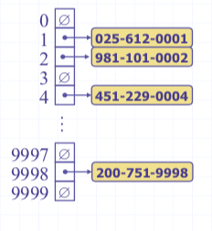

# CSCI241
# Topic 8: Maps and Hash Tables
# 8.1 Maps
+ A Map is an abstract data structure (ADT)
  - it  stores key-value (k,v) pairs 
  - there cannot be duplicate keys 

+ Maps are useful in situations where a key can be viewed as a unique identifier for the object
  - the key is used to decide where to store the object in the structure.  In other words,  the key associated with an object can be viewed as the address for the object 
  - maps are sometimes called associative arrays

+ Note: Maps provide an alternative approach to searching

## 8.1.1 Map ADT/Operations
+ size()
+ isEmpty()
+ get(k):if the map M has an entry with key k, return its associated value; else, return null
+ put(k,v):
  - if the map M does not have an entry with key k,  add entry (k,v) and return null
  - else replace existing value of entry with v  and return the old value
  - (this can be viewed as inserting key k)
+ remove(k): if the map M has an entry with key k, remove it from M and return its associative value; else return null.

## 8.1.2 Map example
**(k,v)   key=integer, value=letter**
~~~~~
              M={}
put(5,A)      M={(5,A)}
put(7,B)      M={(5,A), (7,B)}
put(2,C)      M={(5,A), (7,B), (2,C)}
put(8,D)      M={(5,A), (7,B), (2,C), (8,D)}
put(2,E)      M={(5,A), (7,B), (2,E), (8,D)}
get(7)        return B
get(4)        return null
get(2)        return E
remove(5)     M={(7,B), (2,E), (8,D)}
remove(2)     M={(7,B), (8,D)}
get(2)        return null
~~~~~

## 8.1.3 Map Implemention
+ Arrays (Vector, ArrayList)
+ **Linked-list**
+ Binary search trees
+ Hash tables

### A LinkedList implementation of Maps

+ store the (k,v) pairs in a doubly linked list
+ get(k): hop through the list until find the element with key k
+ put(k,v):
  - find Node x with key k
  - if (x != null), replace the value in x with v
  - else create a new node(k,v) and add it at the front/end

+ remove(k)
  - find Node x with key k
  - f (x == null)  return null
  - else remove node x from the list and return the value
  - Note: why doubly-linked? need to delete at an arbitrary position
+ Analysis: 
  - Linked-list: 
    + put:  O(1) since we can add the new item at the begining or the end of the sequence.
    + get and remove: O(n)
    + the unsorted list implementation is effective only for maps of small size or maps in which puts are the most common operations, while searches and removals are rarely performed.
  - Hash tables: we’ll see that (under some assumptions)  search, insert, delete:  O(1)

+ Code
  - [LinkedMap.java in our class](https://replit.com/@ZhangNing1/CSCI241NingZhang#CSCI241/LinkedMap.java)
  - [UnsortedTableMap.java in Textbook](https://replit.com/@ZhangNing1/CSCI241NingZhang#net/datastructures/UnsortedTableMap.java)

# 8.2 Hash Tables/Hashing
+ A completely different approach to searching from the comparison-based methods (binary search, binary search trees)
+ rather than navigating through a dictionary data structure comparing the search key with the elements,  hashing tries to reference an element in a table directly based on its key
+ hashing transforms a key into a table address

## 8.2.1 Intuitive Notion of a Map
+ Intuitively, a map M supports the abstraction of using keys as indices with a syntax suck as `M[k]`.
+ As a mental warm-up, consider a restricted setting in which a map  with n items uses keys that are known to be integers in a range from 0 to N-1, for some N>=n.

## 8.2.2 More General Kinds of Keys
+ But what should we do if the keys are not integers from 0 to N-1?
  - use a `hash function` to map general keys to corresponding indices in a table
  - For instance, the last 4 digits of a social security number

## 8.2.3 Hash Functions and Hash Tables
+ A hash function `h` maps keys of a given type to integers in a fixed interval `[0,N-1]`.
+ Example: `h(x) = x mod N` is a hash function for integer keys.
+ The integer `h(x)` is called the `hash value` of key x.
+ A `hash table` for a given key consists of 
  - hash function `h`
  - Array(called table) of size N
+ When implementing a map with a hash table, the goal is to store item `(k,v)` at index `i=h(k)`.

+ Example: 
  - We design a table for a map storing entries as `(ssn, name)`, where `ssn` is a nine-digit number
  - Our hash table uses an array of `N=10000` and the hash function `h(x) = last four digit of x`

### 8.2.3.1 Hash Functions
+ A hash function is usually specified as the composition of two functions

~~~~
hash code: h1: keys -> integers
compression function: h2: integers -> [0,N-1]
~~~~

+ The `hash code` is applied first, and the compression function is applied next on the result. 

~~~~
h(x) = h2(h1(x))
~~~~

+ The goal of the hash function is to "disperse" the key in an apparently random way.

### Hash code
+ Memory address:
  - We reinterpret the memory address of the key object as an integer (default hash code of all Java objects)
  - Good in general, except for numeric and string keys

+ Integer cast:
  - We reinterpret the bits of the key as an integer
  - Suitable for keys of length less than or equal to the number of bits of the integer type (e.g., byte, short, int and float in Java)

+ Component sum:
  - We partition the bits of the key into components of fixed length (e.g., 16 or 32 bits) and we sum the components (ignoring overflows)
  - Suitable for numeric keys of fixed length greater than or equal to the number of bits of the integer type (e.g., long and double in Java)

+ Polynomial Accumulation:
  - We partition the bits of the key into a sequence of components of fixed length(e.g., 8, 16, or 32): a0a1 ... an-1
  - We evaluate the polynomial p(z) = a0 + a1z + a2z2 ... + an-1zn-1 at a fixed value z, ignoring overflows.
  - Especially suitable for strings (e.g., the choice z=33 gives at most 6 collisions on a set of 50,000 english words)
  - Polynomial p(z) can be evaluated in O(n) time using Horner's rule.
### Compression Functions
+ `Division`
  - `h2(y) = y mod N`
  - The size N of the hash table is usually chosen to be a prime
  - The reason has to do with number theory and is beyond the scope of this course.
+ `Multipy, And, Divide(MAD)`:
  - `h2(y) = ay+b mod N`
  - `a` and `b` are non-negative integers such that `a mod N is NOT equal to 0`
  - Otherwise, every integer would map to the same value `b`

## 8.2.4 Collision Handling
+ Collisions occur when different elements are mapped to the same cell. 

### Separate Chaining
+ Let each cell in the table point to a linked list of entries that map there
+ Separate chaining is simple, but requires additional memory outside the table.

### Linear Probing
+ `open addressing`: the collision item is placed in a different cell of the table
+ `linear probling`: handles collision by placing the collison item in the next (circularly) available table cell
  - Each table cell inspected is referred to as a `probe`
  - Colliding items lump together, causing future collisions to cause longer sequence of probes
  - Example: `h(x) = x mod 13`, then insert keys 18, 41, 22, 44,  59, 32, 31, 73, in this order

+ `Search with Linear Probing`
  - Consider a hash table A using linear probing
  - get(k): 
    + we start at cell `h(k)`
    + we probe consecutive locations until one of the following occurs
      - At item with key `k` is found or
      - An empty cell is found or
      - N cells have been unsuccessfully probed

   ~~~~
   Algorithm get(k):
    i <- h(k)
    p <- 0
    repeat
      c <- A[i]
      if c = Ø
        return null
      else if c.getKey()=k
        return c.getValue()
      else
        i <- (i+1) mod N
        p <- p+1
     until p=N
     return null
   ~~~~

+ `Updates with Linear Probing`
  - To handle insertions and deletions, we introduce a special object, called `DEFUNCT`, which replaces deleted elements
  - `Remove(k)`:
    + we search for an entry with key `k`
    + If such an entry `(k,v)` is found, we replace it with the special item `DEFUNCT` and return the element `o`
    + Else, we return `null`

  - `put(k,v)`:
    + We throw an exception if the table is full.
    + We start at cell `h(k)`
    + We probe consecutive cells until one of the following occurs
      - A cell `i` is found that is either empty or stores `DEFUNCT` or
      - N cells have been unsuccessfully probed
    + We store `(k,v)` in cell `i`

### Double Hashing
+ Double hashing uses a secondary hash function `d(k)` and handles collisions by placing an item in the first available cell of the series: **(i + jd(k)) mod N for j = 0,1,...,N-1**

+ The second hash function `d(k)` can not have zero values
+ The table size `N` must be a prime to allow probing of all the cells
+ Common choice of compression function for the secondary hash function **d2(k) = q - k mod q** where
  - q < n
  - q is a prime

+ The possible values for d2(k) are `1, 2, ..., q`

+ Example of Double Hashing
  - Consider a hash table storing integer keys that handles collision with double hashing
    + N = 13
    + h(k) = k mod 13
    + d(k) = 7 - k mod 7

  - Insert keys 18, 41, 22, 44, 59, 32, 31, 73, in this order

[Code for Linear Probing and Double Hashing](https://replit.com/@ZhangNing1/CSCI241NingZhang#CSCI241/CollisionHandling.java)
## 8.2.5 Performance of Hashing
+ In the worst case, searches, insertions and removals on a hash table take O(n) time.
+ The worst case occurs when all the keys inserted into the map collide
+ The load factor `α = n/N` affects the performance of a hash table
+ Assume that the hash values are link random numbers, it can be shown that the expected number of probes for an insertion with open addressing is `1/(1-α)`
+ The expected running time of all the dictionary ADT operations in a hash table is `O(1)`
+ In practice, hashing is very fast provided by the load factor is not close to 100%
+ Applications of hash tables
  - small databases
  - compilers
  - browser caches
