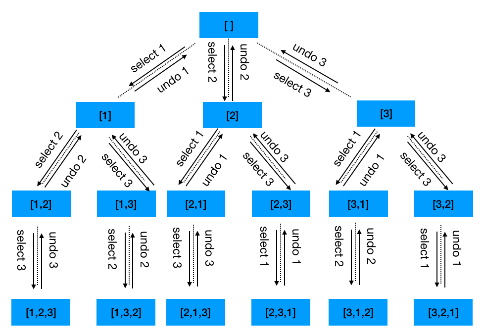
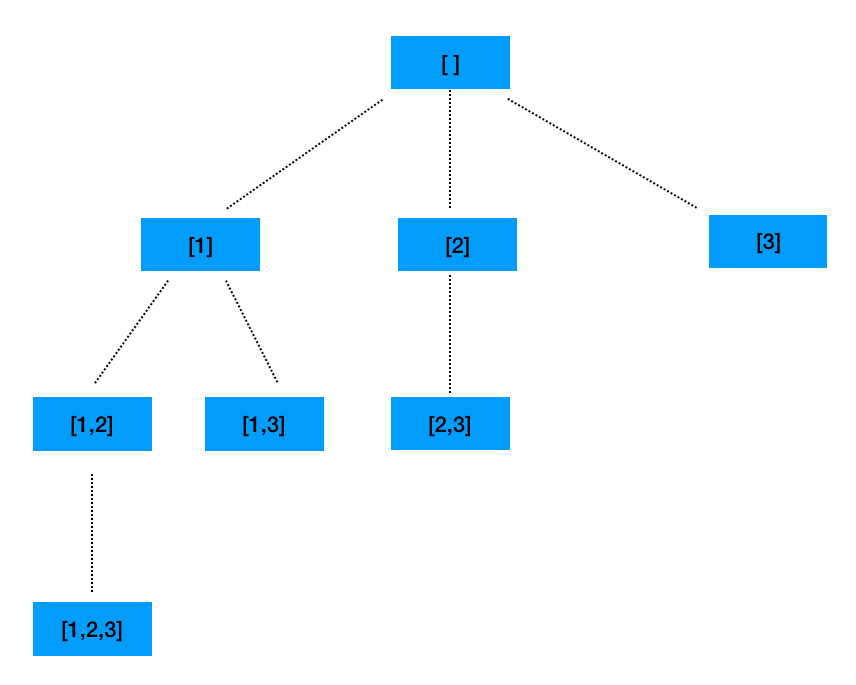

# Backtracking Algorithm
# 1. Introduction
+ Backtracking is an algorithm for finding all solutions by exploring all potential candidates. If the solution candidate turns to be not a solution (or at least not the last one), backtracking algorithm discards it by making some changes on the previous step, i.e. backtracks and then try again.
+ An brute force search algorithm that avoids unnecessary searches.  
+ Using the idea of trial and error.
+ This technique of going back if it does not work is called "backtracking", and the point of a state that satisfies the backtracking condition is called "backtracking point".
+ In short, the backtracking algorithm adopts an algorithmic idea of `backtracking if it does not work`.
+ Backtracking algorithms are usually implemented using simple recursive methods, and two situations are more likely to arise when performing backtracking.
  - Finding a correct answer that may exist.
  - Declaring that the problem has no answer after trying all potential candidates.

# 2. Understanding backtracking algorithms from the permuation problem.

[LeetCode Permutations](https://leetcode.com/problems/permutations/)

Taking the example of solving the full permutation of `[1, 2, 3]`, we will explain the procedure of the backtracking algorithm.
+ 1). Permuations starting with `1`.
  - 1.1 If you select 2 as the middle number, you can only select 3 as the last number, i.e., `[1, 2, 3]`.
  - 1.2 Undo the selection of 3 as the last number, and then undo the selection of 2 as the middle number. Then select 3 as the middle number, then only 2 can be selected as the last number, i.e., the permutaion is [1, 3, 2].

+ 2). Undo 2 as the last number, undo 3 as the middle number, undo 1 as the first number, then select 2 as the first number
  - 2.1 Select 1 as the middle number, you can only select 3 as the last number, i.e., `[2,1,3]`
  - 2.2 Undo the selection of 3 as the last number, and then undo the selection of 1 as the middle number. Then select 3 as the middle number, then only 1 can be selected as the last number, i.e., the permutaion is [2, 3, 1].

+ 3). Undo 1 as the last number, undo 3 as the middle number, undo 2 as the first number, then select 3 as the first number
  - 2.1 Select 1 as the middle number, you can only select 2 as the last number, i.e., `[3,1,2]`
  - 2.2 Undo the selection of 2 as the last number, and then undo the selection of 1 as the middle number. Then select 2 as the middle number, then only 1 can be selected as the last number, i.e., the permutaion is [3, 2, 1].

To summarize the permuation backtracking process
+ The numbers that may appear on each position are enumerated in order, and the numbers that have appeared before cannot appear again for the next number to be selected.
+ For the position:
  - 1. `Select an element`: Select an element from the list of available elements that has not appeared before.
  - 2. `Recursive search`: Starting from the selected element, the remaining numbers are recursively searched one level at a time until **a boundary condition is encountered**, then no further search is performed.
  - 3. `Undo selection`: Undo the previously selected element one layer at a time and move on to another branch of the search. Until all possible paths are completely traversed

+ For the above decision process, we can also use a decision tree to represent it as follows.

+ From the decision tree we can see that
  - Each layer has one or more different nodes, and these nodes and the branches connected to them represent "different options"
  - Each node represents a 'state' for permutation problem, and these states are represented by 'different values'
  - Going a level down is to select an "element" from the "list of available elements" and add it to the "current state"
  - Going a level upwards is to remove the selected "element" from the "current state" and backtrack to the state it would have been in if the element had not been selected (or reset the state), so that other branches can be explored.

+  Code

~~~~~
class Solution {
    public List<List<Integer>> permute(int[] nums) {
        List<List<Integer>> list = new ArrayList<>();// store all the permutations
        List<Integer> tempList = new ArrayList<>(); // store the current permutation
        // Arrays.sort(nums); // not necessary
        backtrack(list, tempList, nums);
        return list;
    }

    private void backtrack(List<List<Integer>> list, List<Integer> tempList, int [] nums){
        if(tempList.size() == nums.length){ // find a permuation (the condition is true)
            list.add(new ArrayList<>(tempList)); // add the current permutation into list
        } else{
            for(int i = 0; i < nums.length; i++){ //enumerate all the elements we can select
                if(tempList.contains(nums[i])) continue; // element already exists, skip
                tempList.add(nums[i]);                   // select the element
                backtrack(list, tempList, nums);      // backtracking search
                tempList.remove(tempList.size() - 1);    // undo the selection
            }
        }
    } 
}
~~~~~

# 3. Generic templates for backtracking
~~~~
res = []                                        // data structure to store all the results that meet the requirement(boundary condition)
curr_re = []                                    // data structure to store the current result
backtracking(res, curr_re, elements){           // elements is the list of the elments we can select
    if(boundary condition is true){             // find a group of elements as one result
        res.add(curr_re)                        // add the current results
        return
    }
    for(i=0;i<len(elements);i++){               // enumerate elements we can select
        if(selection condition is true){
          path.add(elements[i])                   // select element
          backtracking(res, curr_re, elements)    // backtracking
          path.remove(last_element)               // undo selection
      }
    }
}
backtracking(res, curr_re, elements)
~~~~

# 4. Backtracking algorithm in three steps
The basic idea of the backtracking algorithm is to search for the solution of the problem in a `depth-first search` manner, based on the conditional constraints that generate the child nodes. When it is found that the current node no longer satisfies the solution conditions, it "backtracks" and tries other paths.
+ Step 1: draw a decision tree for the search process and determine the search path based on the decision tree
+ Step 2: detemine the termination conditions of the recursion and what to be executed when the recursion terminates
+ Step 3: Translate the decision tree and termination conditions into code.
  - 3.1 Declair the backtracking function (specify the functionality, parameters, return value, etc.)
  - 3.2 Implement/Define the backtracking function (give the constraints, select element, recursive search, and undo the selection part).
  - 3.3 Define recursive termination conditions (give recursive termination conditions and how to handle recursive termination)

## 4.1 Specify all the possible paths 
+ Decision trees are a great tool to help us make sense of the search process. We can draw a decision tree of the search process, based on which we can help us determine the search scope and the corresponding search path.
## 4.2 Specify termination conditions
+ The termination condition of the backtracking algorithm is also the bottom level of the decision tree, i.e., the condition that no more choices can be made is reached.
+ The termination condition of the backtracking function is generally given as depth, leaf nodes, non-leaf nodes (including the root node), all nodes, etc. And you also need to give the following steps under the termination condition, such as outputting the answer, putting the current eligible result into the final result set, etc.

## 4.3 Translate Decision Trees and Termination Conditions into Code
+ After specifying all the paths and specifying the termination conditions, we can translate them into code. This step can also be done in 3 steps.
  - Define the backtracking function (specify the function meaning, parameters, return result, etc.)
  - Complete the body of the backtracking function (give constraints, select elements, recursive search, undo the selection part).
  - Define the recursive termination condition (give the recursive termination condition, and what to do when the recursion is terminated).

### 4.3.1 Declare a backtracking function
+ When defining a backtracking function, be sure to clarify the meaning of the recursive function, that is, understand what the parameters and global variables are for this problem, and what the final returned result is for the problem to be solved.
+ parameters and global variables: are determined by the "current state" at the time of the recursive search phase. It is better to record the "current state" directly through incoming parameters and global variables
  - For example, in the permutation problem, the `backtracking(List<List<Integer>> list, List<Integer> tempList, int [] nums)` function takes `nums` (a list of selectable elements) as an parameter and `list` (a set array of all eligible results) and `tempList` (the current eligible results) as global variables. `nums` represents the current selectable elements and `tempList` is used to record the "current state" of the recursive search phase.  `list` is used to store the "all the states" of the recursive search phase.

+ Return result: The return result is the information that needs to be returned to the upper level function when the recursive termination condition is encountered.
  - Generally, the return result of the backtracking function is a single node or a single value, which tells the higher-level function what our current search result is.
  - Of course, if you use global variables to save the "current state", you can also not need to return the result to the next level function, i.e., return the empty result. For example, the permuation example above.

### 4.3.2 Complete the body of the backtracking function
+ Based on the current list of selectable elements, the given constraints (e.g. the number that has appeared before cannot appear again in the next number to be selected), and the variable that holds the current state, we can write the body part of the backtracking function.

~~~~
for(i=0;i<len(elements);i++){               // enumerate elements we can select
        if(selection condition is true){
          path.add(elements[i])                   // select element
          backtracking(res, curr_re, elements)    // backtracking
          path.remove(last_element)               // undo selection
        }
}
~~~~

### 4.3.3 Specify recursive termination conditions
+ This step actually converts the recursive termination conditions and the following processing steps under the termination conditions from the section `4.2 Specify Termination Conditions` into conditional statements and corresponding execution statements in the code.

~~~~
if(boundary condition is true){                 // find a group of elements as one result
        res.add(curr_re)                        // add the current results
        return
}
~~~~

# 5. Examples
## 5.1 [LeetCode 78: Subsets](https://leetcode.com/problems/subsets/)
Solution:
+ For each element of the array, we have two choices: to select or not to select.
+ We can indicate that an element is selected by adding an optional element to the current subset array. We can also indicate that an element is not selected by removing the previously added element from the current subset array after the current recursion has ended (i.e., backtracking)
+ In the following, we complete the corresponding backtracking algorithm based on the three steps of the backtracking algorithm.

### Step 1. Demonstrate all choices: 
+ Draw a decision tree based on the two choices of selecting or not selecting elements at each position in the array, as shown in the figure below

### Step 2. Specify termination conditions.
+ The traversal terminates when it reaches a leaf node of the decision tree. That is, the recursion terminates when the current path search reaches the end.

### Step 3. Translate the decision tree and termination conditions into code.
#### Define the backtracking function
+ backtracking(nums, index): The incoming arguments to the function are nums (a list of optional arrays) and index (representing the element currently under consideration is nums[i]), and the global variables are res (a set array of all eligible results) and path (the current eligible results).
+ backtracking(nums, index): The function represents the recursive selection of the remaining elements in case `nums[index]` is selected.

#### Complete the body of the backtracking function
+ Enumerates all the optional elements from the current element being considered, up to the end of the array. For each optional element
  - Constraint: Previously selected elements are not repeated. The reason for iterating from the index position instead of the 0 position is to avoid duplication. Unlike full permutations, subsets {1, 2} and {2, 1} are equivalent. To avoid repetition, we do not repeat the elements we considered before.
  - Select element: add it to the current subset path.
  - Recursive search: in case of selecting this element, continue recursively considering the element at the next position.
  - Undo selection: Remove the element from the current subset array path
### Specify termination conditions
+ The traversal terminates when it reaches the leaf nodes of the decision tree. That is, the recursion stops when the position of the element under consideration reaches the end of the array (i.e., start >= len(nums)).
+ It is also clear from the decision tree that the set of answers that the subset needs to store should contain all the nodes on the decision tree and should need to save all the states of the recursive search. So whether the termination condition is reached or not, we should put the current eligible results into the set.
+ Code
~~~~
class Solution {
  List<List<Integer>> output = new ArrayList();
  int n, k;

  public void backtrack(int first, ArrayList<Integer> curr, int[] nums) {
    // if the combination is done
    if (curr.size() == k) {
      output.add(new ArrayList(curr));
      return;
    }
    for (int i = first; i < n; ++i) {
      // add i into the current combination
      curr.add(nums[i]);
      // use next integers to complete the combination
      backtrack(i + 1, curr, nums);
      // backtrack
      curr.remove(curr.size() - 1);
    }
  }

  public List<List<Integer>> subsets(int[] nums) {
    n = nums.length;
    for (k = 0; k < n + 1; ++k) {
      backtrack(0, new ArrayList<Integer>(), nums);
    }
    return output;
  }
}
~~~~
## 5.2 [LeetCode 51: N-Queens](https://leetcode.com/problems/n-queens/)
### Solution
+ This problem is a classic backtracking problem. We can place the queens in row order, that is, the first row, then the second row ...... all the way to the last row.
+ For an `n * n` board, there are n columns in each row, which means there are n ways to place them. We can try to select one of the columns and see if it conflicts with the previously placed queens, and if it does not, continue to place queens in the next row. And so on, until all queens are placed and none of them are in conflict, then we have a reasonable solution.
+ And after placement, try other possible branches by backtracking.

## Backtracking in 3 steps
### Step 1: Find all the paths

### Step 2: Specify termination condition
+ The traversal terminates when it reaches the leaf node of the decision tree. That is, the recursion terminates when the queen is placed at the end of the last row.

### Step 3: 
#### Define the backtracking function
+ First we start with a two-dimensional matrix chessboard of size `n * n` to represent the current board, the characters `Q` in the chessboard represent queens and `.` represents the empty squares. The chessboard will be all `.` initially .
+ Then we define the backtrack function `backtrack(chessboard, row)`. the arguments of the function are chessboard (the array of chessboards) and row (representing the current row of queens being considered for placement), and the global variable res (the set array of all eligible results).
+ backtrack(chessboard, row): function means `recursively place the queens of the remaining rows if the queens of the row are placed`.
#### Complete the body of the backtracking function
Enumerates all columns of the current row. For each column position.
+ Constraint: Define a judgment method that first determines if the current position conflicts with a previously placed queen on the board, if not then continue placing, otherwise continue traversing backwards.
+ Select element: Select row, col position to place the queen, and set the corresponding position on the board to Q.
+ Recursive search: If a queen is placed at that position, continue recursively considering the next row.
+ Undo selection: Set the row, col position on the board to .
### Specify termination conditions
+ The recursion terminates when the traversal reaches a leaf node of the decision tree. That is, the recursion stops when the queen is placed in the last row (i.e., row == n).
+ When the recursion stops, the current eligible board is converted to the form needed for the answer, and then it is simply stored in the answer array res.

## Code
~~~~

~~~~
