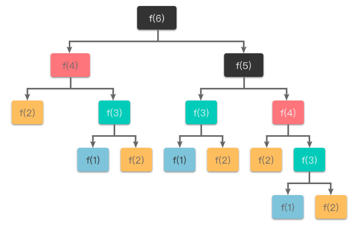
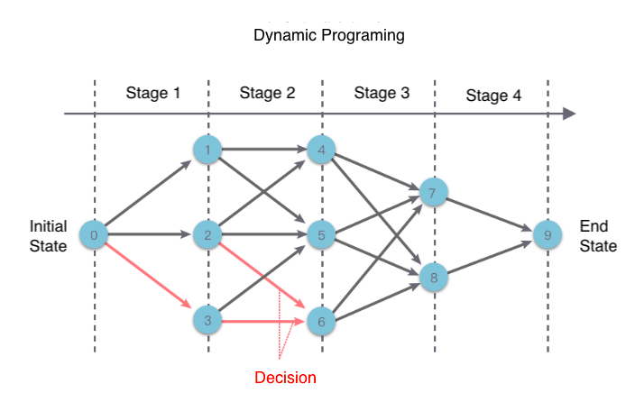

# Dynamic Programming Algorithm

# 1. Introduction
## 1.1 Definition
+ Dynamic Programming: DP is a method for solving complex problems by decomposing the original problem into relatively simple subproblems.
+ Dynamic programming was first introduced by Richard Bellman in 1957 in his book **Dynamic Programming**. Programming here does not mean coding, but rather a method of processing tables in which the results of each step are stored in a table for subsequent computational queries.
+ Dynamic programming is similar to Divide-and-Conquer, yet different from it. The difference between dynamic programming and Divide-and-Conquer algorithms is that the problems that are suitable for dynamic programming are often interconnected after decomposition, and several overlapping subproblems may appear. By using dynamic programming, the solutions of these overlapping subproblems are saved in a table for subsequent computational queries, thus avoiding a lot of repeated computations.
+ The core idea of dynamic programming is
  - The `original problem` is decomposed into `several overlapping subproblems`, each of which constitutes a `phase`. After completing the computation of one phase, the dynamic programming method performs the computation of the next phase.
  - In the process of solving the subproblems, the "solutions of the subproblems" are solved in bottom-up order, and the results are stored in a table, so that when the subproblems need to be solved again, the solutions of the subproblems are directly queried from the table, thus avoiding a lot of repeated calculations.

## 1.2 Characteristics of DP
Problems that can be solved using dynamic programming must satisfy the following three characteristics: 
+ optimal substructures
+ overlapping subproblems
+ no posteriority.

### 1.2.1 optimal substructures
+ "Optimal substructures" means that the optimal solution of a problem contains the optimal solutions of its subproblems.
+ For example, as shown in the figure below, the problem `S={a1,a2,a3,a4}` is transformed into solving a subproblem `Ssub={a2,a3,a4}` after we select a current optimal solution in the first step `a1`. If the optimal solution of the original problem can be composed of "the local optimal solution obtained in step 1" and "the optimal solution of the subproblem", then the problem satisfies the optimal substructure property.
+ In other words, if the optimal solution of the original problem contains the optimal solution of the subproblems, then the problem satisfies the optimal substructure property.

### 1.2.2 overlapping subproblems
+ It refers to the process of solving subproblems where a large number of subproblems are repeated and a subproblem will be used possibly several times in the next stage of decision making. If there are a large number of repeated subproblems, then it is only necessary to solve the problem once and then store the result in a table, so that it can be directly queried when it is used later without solving it again.
+ As an example, let's say the Fibonacci series is defined by f(1) = 1, f(2) = 2, f(n) = f(n - 1) + f(n - 2). The corresponding recursive process is shown below, where f(1), f(2), f(3), and f(4) are computed repeatedly. If we store the results of f(1), f(2), f(3), and f(4) in the table when we calculate them for the first time, we can query them directly when we use them again, thus avoiding solving the same subproblems repeatedly and improving efficiency.

### 1.2.3 no posteriority
+ This refers to the fact that the solution (state values) of a subproblem is related only to the previous stages and not to the later stages. Once a number of state values in the current stage are determined, they do not change anymore and are not affected by the decisions in the subsequent stages. In other words, once the solution of a particular subproblem has been determined, it will not be modified again.
+ In fact, we can also think of dynamic programming as the process of solving the longest (shortest) path of a `directed acyclic graph`. Each state corresponds to a node on the directed acyclic graph, and the decision corresponds to a directed edge in the graph.
+ If a problem has "posteriority", it may need to be transformed or solved backwards to eliminate the posteriority before dynamic programming methods can be used.

# 2. Steps of DP
+ As shown in the figure below, when we use dynamic programming to solve certain `optimization problems`, we can decompose the problem-solving process into a number of interconnected "stages" in a certain order (temporal, spatial, or other order). Then, for each stage, a "decision" is made, which determines both the "benefit" of this stage and the initial state of the next stage. After making decisions for each stage in turn, a sequence of decisions for the entire problem is obtained.
+ This decomposes an original problem into a series of subproblems, which are then solved step by step to obtain the final result.

+ This kind of multi-stage decision making problem with a chain-like structure is also called "multi-stage decision making problem".
+ Usually we use dynamic programming to solve multi-stage decision problems with the following basic steps.
  - 1). **Partiton stages**: The original problem is decomposed into a number of interrelated "stages" in a sequential order (chronological, spatial, or otherwise). The partitioned stages must be ordered or sortable, otherwise the problem can not be solved.
    + `Stages` here refers to the process of solving subproblems. The process of solving each subproblem constitutes a "stage", and the solution of the next stage will be carried out only after the solution of the previous stage has been completed.

  - 2). **Define state**: Use some variable related to the subproblem (position, quantity, volume, space, etc.) to define a "state". The chosen state must satisfy `no posteriority`.
    + A "state" corresponds to one or more subproblems, and the values in a "state" refers to the solution of the corresponding subproblem.

  - 3). **Transfer state equation**: Based on the `state of the previous stage` and the `decisions that can be made in that state`, we derive the `state of the next stage`. In other words, we determine the decision based on the relationship between the states of two adjacent stages, and then derive the way to transfer the states to each other (i.e., the "state transfer equation").
  - 4). **Initial and boundary conditions**: Determine the initial and boundary conditions based on the problem description, state definition and state transfer equations.
  - 5). **Final result**: Determine the objective of the problem, and then each stage of the problem is solved in a certain order. Finally, the final result is determined based on the recursive results of the state transfer equation.

# 3. Examples
+ Dynamic programming-related problems tend to be flexible and difficult to figure out, without a particularly obvious formula, and often appear in various algorithm competitions and interviews.
+ The keys of dynamic programming problems are "how to design the state" and "derive the state transfer condition", and various "optimization methods". 
## 3.1 [LeetCode 509: Fibonacci Number](https://leetcode.com/problems/fibonacci-number/)
### 1). Partition stages
+ We can partition the stages in integer order by dividing them into integers `0 ~ n`.
### 2). Define state
+ Define the state `dp[i]` as: the i-th Fibonacci number
### 3). State transfer equation
+ According to the definition of the Fibonacci series given in the question `f(n) = f(n - 1) + f(n - 2)`, it is straightforward to derive the state transfer equation as `dp[i] = dp[i - 1] + dp[i - 2]`
### 4). Initial condition
+ Determine the initial conditions of dynamic programming according to the initial conditions `f(0) = 0, f(1) = 1` given in the question, i.e., `dp[0] = 0, dp[1] = 1`.
### 5). Final result
+ According to the state definition, the final result is `dp[n]`, i.e., the nth Fibonacci number is `dp[n]`.

### Code
~~~~
class Solution {
    public int fib(int n) {
        if(n<=1){
            return n;
        }
        int[] dp = new int[n+1];
        dp[0] = 0;
        dp[1] = 1;
        for(int i=2; i<n+1; i++){
            dp[i] = dp[i-1] + dp[i-2];
        } 
        return dp[n];
    }
}
~~~~

## 3.2 [LeetCode 70: Climing Stairs](https://leetcode.com/problems/climbing-stairs/)
### 1). Partition stages
+ We can partition the stages into `0 ~ n` steps.
### 2). Define state
+ `dp[i]`: number of distinct ways to climb to step i
### 3). State transfer equation
+ According to the question, We can climb only 1 or 2 steps at a time. Then to climb to `step i`, we can either climb 1 step up from the `step i-1` or 2 steps up from the `step i - 2` . So the state transfer equation can be derived as `dp[i] = dp[i - 1] + dp[i - 2]`. 
### 4). Initial condition
+ `dp[0]=1`: number of distinct ways to climb to step 0 is 1.
+ `dp[1]=1`: number of distinct ways to climb to step 1 is 1. 
+ `dp[2]=2`: number of distinct ways to climb to step 2 is 2. （2 steps at a time or 1 step and 1 step, that is why we define dp[0]=1. And in the code, we only need to define dp[0] and dp[1]） 
### 5). Final result
+ According to the state definition, the final result is `dp[n]`.

### Code
~~~~
class Solution {
    public int climbStairs(int n) {
        if(n<=1){
            return 1;
        }
        int[] dp = new int[n+1];
        dp[0] = 1;
        dp[1] = 1;
        for(int i=2; i<n+1; i++){
            dp[i] = dp[i-1] + dp[i-2];
        } 
        return dp[n];
    }
}
~~~~

## 3.3  [LeetCode 62: Unique Paths](https://leetcode.com/problems/unique-paths/)
### 1). Partition stages
+ We can partition the stages according to the location (x-y coordinates).
### 2). Define state
+ `dp[i][j]`: number of distinct paths from `[0][0]` to `[i][j]`.
### 3). State transfer equation
+ Since we can only move one step to the right, or downwards, at a time, to get to `(i, j)`, we can only go one step down from `(i - 1, j)`; or one step to the right from `(i, j - 1)`. So the state transfer equation can be written as: `dp[i][j] = dp[i - 1][j] + dp[i][j - 1]`, when i > 0 and j > 0.
### 4). Initial condition
+ There is only one way to go from the top left corner to (0, 0), i.e. `dp[0][0] = 1`.
+ The elements in thefirst row have only one path (i.e., it can only be obtained by going right through the previous element), so `dp[0][j] = 1`.
+ Similarly, the elements in the first column also have only one path (i.e., it can only be obtained by going down through the previous element), so `dp[i][0] = 1`.
### 5). Final result
+ According to the state definition, the final result is `dp[m - 1][n - 1]`, i.e., the number of paths from the top left corner to the bottom right (m - 1, n - 1) position is `dp[m - 1][n - 1]`.

### Code

~~~~
class Solution {
    public int uniquePaths(int m, int n) {
        int[][] dp = new int[m][n];
        for(int i=0; i<m; i++) 
            dp[i][0] = 1;
        for(int j=1; j<n; j++) 
            dp[0][j] = 1;
        for(int i=1; i<m; i++){
            for(int j=1; j<n; j++){
                dp[i][j] = dp[i - 1][j] + dp[i][j - 1];
            }
        }
        return dp[m-1][n-1];
    }
}
~~~~

# More about DP
## Memoization
+ Most of the Dynamic Programming problems are solved in two ways: Tabulation: Bottom Up; Memoization: Top Down
+ Examples: LeetCode 1137,0375,0494,0576,0087,0403,0552,0913,0329

## Linear DP
+ Examples: LeetCode 0118,0119,0198,0213,0338,0045,0115,0403,0576,0091,0639,0650,0678,0688,1137,1220,1751,1787,0300,1143,0120,0053,0152,0887,0072,0044,0010,0354,0121,0122,0123,0188,0309,0714

## Knapsack problem
+ Examples: LeetCode  0279,0322,0416,0474,0494,0518,0638,0879,1049,1155,1449,1995

## interval scheduling
+ Examples: LeetCode 1995,0375,0516,0730,1039,0664,0877,2104,0312

## DP on trees
+ Examples: LeetCode 0124,0543,0337,0333

## State Compression
+ Examples: LeetCode 0526,0464,0847,1994,0935,1349

## Counting bits
+ Examples: LeetCode 0062,0063,0096,1259

## Digit DP
+ Examples: LeetCode 0600,0233,0902,1015

## Probabilistic DP
+ Examples: LeetCode 0688,0808,0837

## DP Optimization
