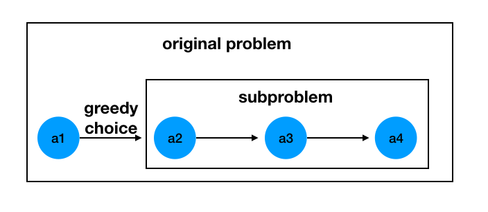
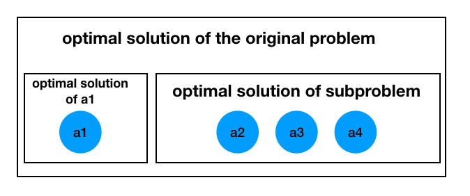

# Greedy Algorithm
# 1. Introduction
## 1.1 Definition
+ An algorithm that always takes the best choice in the current state at each decision, thus hopefully leading to an outcome that is the best or optimal.
+ The greedy algorithm is a modified "step-by-step solution algorithm". The core idea is to divide the solution process into "several steps", and then choose a "metric" according to the problem, and apply the "greedy principle" at each step to select the "best/optimal choice (local optimal solution)" in the current state, and hope that the final result is also the "best/optimal result (global optimal solution)".
+ In other words, instead of considering the overall optimum, the greedy algorithm proceeds one step at a time, making a locally optimal choice based on some optimization measure at each step, thus eliminating the time required to exhaust all possibilities in order to find the optimal solution.
+ Of course, the final solution obtained using the greedy algorithm is not necessarily the global optimal solution. But for many problems, it is indeed possible to obtain the global optimal solution or an approximate solution to the global optimal solution by a locally optimal solution.
+ In general, these problems that can be solved using greedy algorithms must satisfy the following two characteristics: "Greedy choice property" and "optimal substructure"

## 1.2 Characteristics of Greedy Algorithm
### 1.2.1 Greedy choice property
+ "Greedy choice": means that the globally optimal solution of a problem can be obtained by a series of locally optimal solutions (greedy choice).

+ In other words, when making a choice, we directly make the choice that seems optimal in the current problem, without considering the solutions of the subproblems. Only after the choice is made do we solve the remaining subproblems, as shown in the following figure.

+ The greedy algorithm may rely on previous choices when making selections, but does not rely on any future choices or solutions to subproblems. Problems solved using the greedy algorithm have no backtracking during the operation of the program.

### 1.2.2 Optimal substructure
+ Optimal substructure: means that the optimal solution of a problem contains the optimal solutions of its subproblems.
+ The optimal substructure property of the problem is the key to whether the problem can be solved by the greedy algorithm. For example, the following problem `S = {a1, a2, a3, a4}`, After we select the optimal choice for `a1`, the problem 
becomes to solve the subproblem `S' = {a2, a3, a4}`. If the optimal solution of the original problem can be composed of "the local optimal solution chosen by greed in the first step" and "the optimal solution of the subproblem", then the problem satisfies the optimal substructure property. That is, if the optimal solution of the original problem contains the optimal solution of the subproblem, then the problem satisfies the optimal substructure property.

+ After making a greedy choice, the original problem satisfying the optimal substructure property can be decomposed into similar subproblems of smaller size to solve, and the optimal solution of the problem can be deduced from the greedy choice and the optimal solution of the subproblem.
+ Conversely, if the optimal solution of a subproblem cannot be used to derive the optimal solution of the whole problem, then such a problem does not have an optimal substructure.

## 1.3 Proof of correctness of greedy algorithm
The most difficult part of the greedy algorithm is not the solution of the problem, but the proof of its correctness. The common methods of proof are "mathematical induction" and "exchange argumentation".
+ Induction: The optimal solution for the boundary case (e.g. when n=1 ) is first computed, and then it is shown that for each Fn+1, it can be derived from Fn.
+ Exchange argument method: Starting from the optimal solution, the current solution is presumed to be optimal if the answer does not become better after exchanging any two elements / two adjacent elements of the solution, under the premise that the global optimum remains unchanged.
+ Determining whether a problem is solved by a greedy algorithm requires a rigorous mathematical proof. However, in everyday problem writing or algorithm interviews, it is unlikely that people will be asked to prove the correctness of the greedy algorithm.
+ So, when we want to determine whether a problem is solved by the greedy algorithm, we can
  - use your **intuition**: If you feel that the problem can be done by the "greedy algorithm", try to find the local optimal solution, and then derive the global optimal solution.
  - give counterexamples: Try to give counterexamples. That is, find an example where the local optimal solution cannot be deduced from the global optimal solution, or find an example where replacing the optimal solution of the current subproblem leads to a more optimal solution. If no counter-examples are given, most likely the problem can be solved by the greedy algorithm.

## 1.4 Greedy algorithm in three steps
+ **Convert problem**: Convert the optimization problem into a greedy choice problem, i.e., make a choice first and then solve the remaining subproblem.
+ **Greedy choice property**: Choose a metric according to the question and formulate a greedy strategy to select the "best/optimally choice" in the current state to obtain a locally optimal solution.
+ **Optimal substructure property**: According to the greedy strategy developed in the previous step, the local optimal solution and the optimal solution of the subproblem are combined to obtain the optimal solution of the original problem.

## 1.5 Example
[leetcode 455: Assign Cookies](https://leetcode.com/problems/assign-cookies/)

### 1.5.1 Solution
+ To satisfy as many children as possible, and because a cookie cannot be broken in half, we should try to let children with small appetites eat small cookies so that children with large appetites can have large cookies to eat.
+ So, from the greedy algorithm point of view, we should sort the array `g` by the child's appetite from smallest to largest, and then sort the array `s` by the size of the cookies from smallest to largest, and for each child, we should choose the cookie that satisfies that child's appetite and has the smallest size.
#### Here we solve the problem using the greedy algorithm in three steps
+ Convert problem: After the child with the smallest appetite has chosen the cookie that satisfies that child's appetite and is the smallest in size, solve the remaining child's choice (subproblem).
+ Greedy choice: For the current child, satisfy this child's appetite with cookies of the smallest possible size.
+ Optimal substructure property: Under the above greedy strategy, the current child's greedy choice + the optimal solution to the subproblem of the remaining children is the global optimal solution. That is, under the greedy choice scheme, it is possible to make the maximum number of children that satisfy the appetite.

#### Pseducode
~~~~
step 1: Sort the arrays g and s from smallest to largest, using the variables index_g and index_s to point to the initial position of g and s, respectively, and the variable res to save the result, initialized to 0.
step 2: Compare each element g[index_g] and s[index_s].
        2.1 If g[index_g] <= s[index_s], which means that the current cookie satisfies the current child's appetite, add 1 to the number of answers and move index_g and index_s to the right.
        2.2 If g[index_g] > s[index_s], the current cookie does not satisfy the current child's appetite, move index_s to the right and determine if the next cookie will satisfy the current child's appetite.
step 3: Output the answer res after traversal.
~~~~
