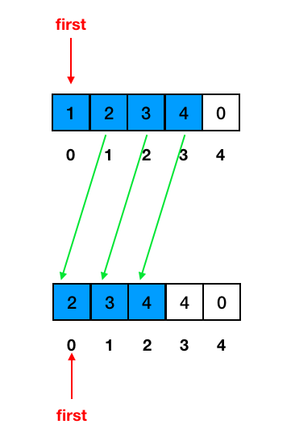
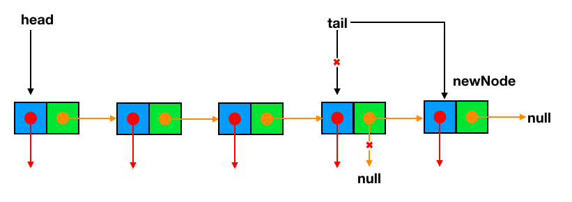

# 4.2 Queues
## 4.2.1 Introduction
+ a close “cousin” of the stack
+ a collection of objects that are inserted and removed according to the `first-in, first-out (FIFO)` principle
+ elements can be inserted at any time, but only the element that has been in the queue the longest can be next removed.

+ A metaphor for this terminology is a line of people waiting to get on an amusement park ride. People waiting for such a ride enter at the back of the line and get on the ride from the front of the line. 
+ There are many other applications
  - Stores, theaters, reservation centers, and other similar services typically process customer requests according to the FIFO principle.
  - FIFO queues are also used by many computing devices, such as a networked printer, or a Web server responding to requests.

## 4.2.2 Operations
Formally, the queue abstract data type defines a collection that keeps objects in a sequence, where element access and deletion are restricted to the first element in the queue, and element insertion is restricted to the back of the sequence.

+ `enqueue(e)`: Adds element e to the back of queue.
+ `dequeue()`: Removes and returns the first element from the queue (or null if the queue is empty).
+ `first()`: Returns the first element of the queue, without removing it (or null if the queue is empty).
+ `size()`: Returns the number of elements in the queue.
+ `isEmpty()`: Returns a boolean indicating whether the queue is empty.
+ `isFull()`: Returns a boolean indicating whether the queue is empty(array-based queue only).

## 4.2.3 Array-bases Queues
+ In our class, we focus on integer elements. See [ArrayQueue.java](https://replit.com/@ZhangNing1/CSCI241NingZhang#CSCI241/ArrayQueue.java)
+ For the generic version, See the code provided in the textbook. [ArrayQueue.java](https://replit.com/@ZhangNing1/CSCI241NingZhang#net/datastructures/ArrayStack.java)
+ You can also use the `java.util.Queue Class` directly in Java

### 4.2.3.1 Create a queue object
+ A newly created stack has a default or given capacity.
+ A newly created stack is empty.
+ A newly created stack has three attributes:
  - data: a reference to the underlying array.
  - first: an integer that represents the index, within array data, of the first element of the queue.
  - sz: an integer representing the current number of elements stored in the queue (not to be confused with the length of the array).

### 4.2.3.1 dequeue
+ If we use the `deleteFirst()` method in array, we need several moves(a loop statement in your code).

+ Instead, we simply let `first` to point to the next element.

+ Then, we need to deal with cases like this:

~~~~
// pseudo code
if(queue is empty) return null or generate exception

first = (first+1)%length;
sz--;
return element
~~~~

### 4.2.3.1 enqueue
+ The goal of the enqueue method is to add a new element to the back of the queue.
+ We need to determine the proper index at which to place the new element.

+ We need to modulo operation again because of cases like this:

~~~~
// pseudo code
if(queue is full) return null or generate exception

index = (first+sz)%length;
data[index] = element;
sz++;
~~~~

## 4.2.4 Singly Linked List-bases Queues

## 4.2.4.1 dequeue
+ equivelant to `delete head` method in singly linked list data structure.

## 4.2.4.2 enqueue
+ equivelant to `insert after tail` method in singly linked list data structure.

