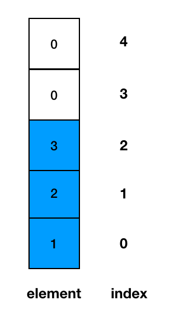
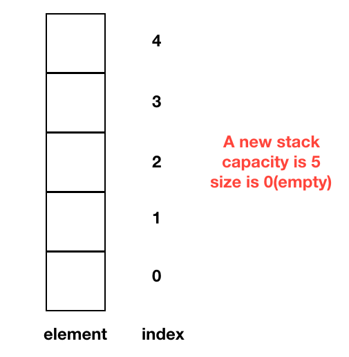
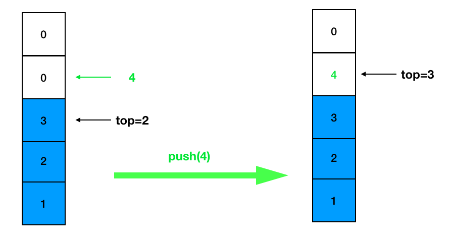
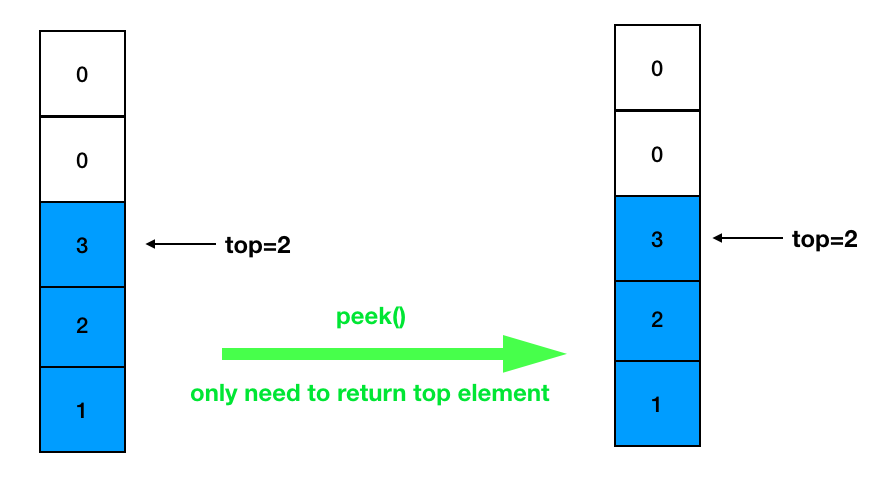
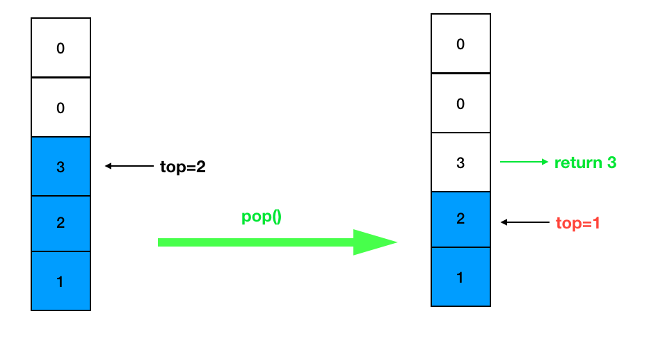
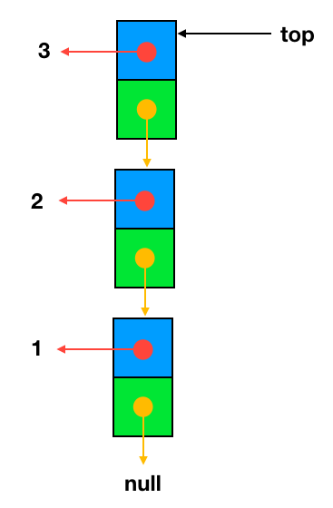
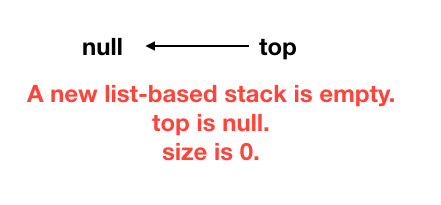
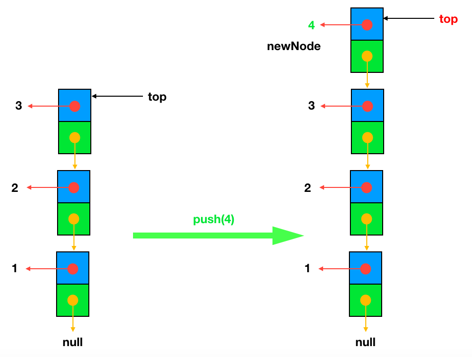
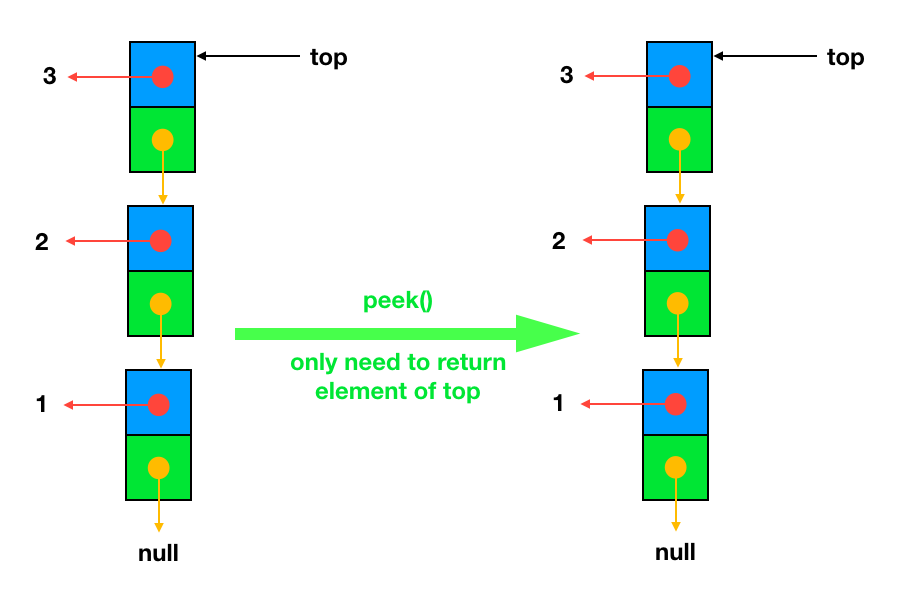
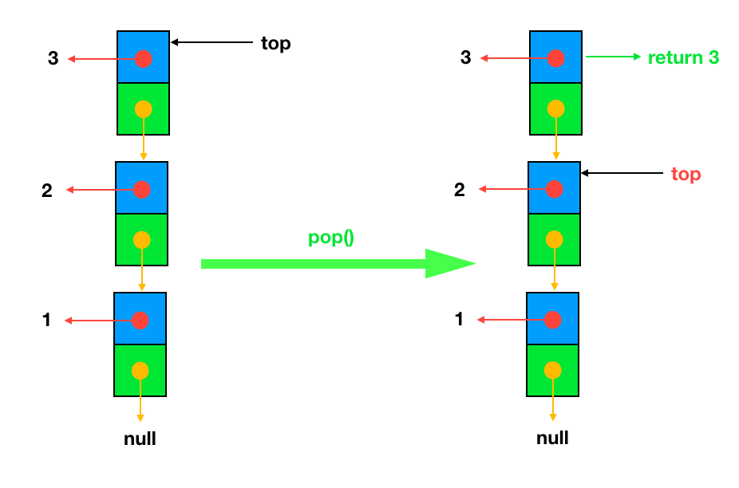

# 4.1 Stacks

## 4.1.1 Introduction
+ A stack is a collection of objects that are inserted and removed according to the `last-in, first-out (LIFO)` principle.
+ A user may insert objects into a stack at any time, but may only access or remove the most recently inserted object that remains (at the so-called “top” of the stack).

+ The name “stack” is derived from the metaphor of a stack of plates in a spring-loaded, cafeteria plate dispenser.

+ Stacks are a fundamental data structure. They are used in many applications, including the following.
  - Internet Web browsers store the addresses of recently visited sites on a stack. Each time a user visits a new site, that site’s address is “pushed” onto the stack of addresses. The browser then allows the user to “pop” back to previously visited sites using the “back” button.
  - Text editors usually provide an “undo” mechanism that cancels re- cent editing operations and reverts to former states of a document. This undo operation can be accomplished by keeping text changes in a stack.

## 4.1.2 Operations
+ push(e): Adds element e to the top of the stack.
+ pop(): Removes and returns the top element from the stack (or null if the stack is empty).
+ top(): Returns the top element of the stack, without removing it (or null if the stack is empty)(Another commonly used name is `peak()`).
+ size(): Returns the number of elements in the stack.
+ isEmpty(): Returns a boolean indicating whether the stack is empty.
+ isFull(): Returns a boolean indicating whether the stack is full. 

## 4.1.3 Array-based Stack
+ In our class, we focus on integer elements. See [ArrayStack.java](https://replit.com/@ZhangNing1/CSCI241NingZhang#CSCI241/ArrayStack.java)
+ For the generic version, See the code provided in the textbook. [ArrayStack.java](https://replit.com/@ZhangNing1/CSCI241NingZhang#net/datastructures/ArrayStack.java)

### 4.1.3.1 Create a stack object
+ A newly created stack has a default or given `capacity`.
+ A newly created stack is empty.

### 4.1.3.2 push
+ Step 1: Checks if the stack is full. If the stack is full, produces an error and exit.
+ Step 2: If the stack is not full, increments top to point next empty space.
+ Step 3: Adds data element to the stack location, where top is pointing.

### 4.1.3.3 peek
+ Step 1: Checks if the stack is empty. If the stack is empty, return `null`.
+ Step 2: If the stack is not empty, return top element.

### 4.1.3.4 pop
+ Step 1: Checks if the stack is empty. If the stack is empty, produces an error and exit.
+ Step 2: If the stack is not empty, increments top to point next empty space.
+ Step 3: accesses the data element at which top is pointing.

## 4.1.3 Array-based Stack
+ In our class, we focus on integer elements. See [ArrayStack.java](https://replit.com/@ZhangNing1/CSCI241NingZhang#CSCI241/ArrayStack.java)
+ For the generic version, See the code provided in the textbook. [ArrayStack.java](https://replit.com/@ZhangNing1/CSCI241NingZhang#net/datastructures/ArrayStack.java)

### 4.1.3.1 Create a stack object
+ A newly created stack has a default or given `capacity`.
+ A newly created stack is empty.

### 4.1.3.2 push
+ Step 1: Checks if the stack is full. If the stack is full, produces an error and exit.
+ Step 2: If the stack is not full, increments top to point next empty space.
+ Step 3: Adds data element to the stack location, where top is pointing.

### 4.1.3.3 peek
+ Step 1: Checks if the stack is empty. If the stack is empty, return `null`.
+ Step 2: If the stack is not empty, return top element.

### 4.1.3.4 pop
+ Step 1: Checks if the stack is empty. If the stack is empty, produces an error and exit.
+ Step 2: If the stack is not empty, increments top to point next empty space.
+ Step 3: accesses the data element at which top is pointing.

## 4.1.4 List-based Stack
+ In our class, we focus on integer elements. See [ListStack.java](https://replit.com/@ZhangNing1/CSCI241NingZhang#CSCI241/ListStack.java)
+ For the generic version, See the code provided in the textbook. [LinkedStack.java](https://replit.com/@ZhangNing1/CSCI241NingZhang#net/datastructures//LinkedStack.java)

### 4.1.4.1 Create a stack object
+ A newly created stack has a default or given `capacity`.
+ A newly created stack is empty.

### 4.1.4.2 push
+ Step 1: Checks if the stack is full. If the stack is full, produces an error and exit.
+ Step 2: If the stack is not full, increments top to point next empty space.
+ Step 3: Adds data element to the stack location, where top is pointing.

### 4.1.4.3 peek
+ Step 1: Checks if the stack is empty. If the stack is empty, return `null`.
+ Step 2: If the stack is not empty, return top element.

### 4.1.4.4 pop
+ Step 1: Checks if the stack is empty. If the stack is empty, produces an error and exit.
+ Step 2: If the stack is not empty, increments top to point next empty space.
+ Step 3: accesses the data element at which top is pointing.

# References
+ [tutorialspoin](https://www.tutorialspoint.com/data_structures_algorithms/stack_algorithm.htm)

