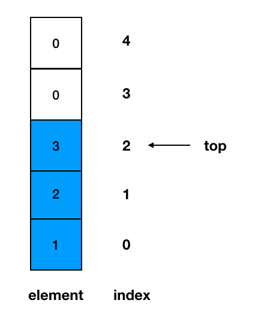
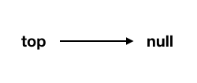

# 4.1 Stacks

## 4.1.1 Introduction
+ A stack is a collection of objects that are inserted and removed according to the `last-in, first-out (LIFO)` principle.
+ A user may insert objects into a stack at any time, but may only access or remove the most recently inserted object that remains (at the so-called “top” of the stack).

+ The name “stack” is derived from the metaphor of a stack of plates in a spring-loaded, cafeteria plate dispenser.

+ Stacks are a fundamental data structure. They are used in many applications, including the following.
  - Internet Web browsers store the addresses of recently visited sites on a stack. Each time a user visits a new site, that site’s address is “pushed” onto the stack of addresses. The browser then allows the user to “pop” back to previously visited sites using the “back” button.
  - Text editors usually provide an “undo” mechanism that cancels re- cent editing operations and reverts to former states of a document. This undo operation can be accomplished by keeping text changes in a stack.

## 4.1.2 Operations
+ push(e): Adds element e to the top of the stack.
+ pop(): Removes and returns the top element from the stack (or null if the stack is empty).
+ top(): Returns the top element of the stack, without removing it (or null if the stack is empty)(Another commonly used name is `peak()`).
+ size(): Returns the number of elements in the stack.
+ isEmpty(): Returns a boolean indicating whether the stack is empty.
+ isFull(): Returns a boolean indicating whether the stack is full(only for array-based stacks). 

## 4.1.3 Array-based Stack
+ In our class, we focus on integer elements. See [ArrayStack.java](https://replit.com/@ZhangNing1/CSCI241NingZhang#CSCI241/ArrayStack.java)
+ For the generic version, See the code provided in the textbook. [ArrayStack.java](https://replit.com/@ZhangNing1/CSCI241NingZhang#net/datastructures/ArrayStack.java)

### 4.1.3.1 Create a stack object
+ A newly created stack has a default or given `capacity`.
+ A newly created stack is empty.

### 4.1.3.2 push
+ Step 1: Check if the stack is full. If the stack is full, produces an error and exit.
+ Step 2: If the stack is not full, increments top to point next empty space.
+ Step 3: Add data element to the stack location, where top is pointing.

### 4.1.3.3 peek
+ Step 1: Check if the stack is empty.  If the stack is empty, produces an error and exit(You can also return `null` if you want).
+ Step 2: If the stack is not empty, return top element.

### 4.1.3.4 pop
+ Step 1: Check if the stack is empty. If the stack is empty, produces an error and exit.
+ Step 2: If the stack is not empty, access the element at which top is pointing.
+ Step 3: change `top` to point next space(decrease `top` by 1).

## 4.1.4 List-based Stack
+ In our class, we focus on integer elements. See [ListStack.java](https://replit.com/@ZhangNing1/CSCI241NingZhang#CSCI241/ListStack.java)
+ For the generic version, See the code provided in the textbook. [LinkedStack.java](https://replit.com/@ZhangNing1/CSCI241NingZhang#net/datastructures//LinkedStack.java)

### 4.1.4.1 Create a stack object
+ A newly created stack has NO `nodes`.
+ A newly created stack is empty.
+ Note that we do not need to define `tail` because all the operations will only "change" `head`.

### 4.1.4.2 push
+ Step 1: Create a new node to store the new element
+ Step 2: change `next` of `new node` to point to `top`
+ Step 3: change `top` to point to `new node`

### 4.1.4.3 peek
+ Step 1: Checks if the stack is empty. If the stack is empty, produces an error and exit(You can also return `null` if you want).
+ Step 2: If the stack is not empty, return element of `top`.

### 4.1.4.4 pop
+ Step 1: Checks if the stack is empty. If the stack is empty, produces an error and exit.
+ Step 2: If the stack is not empty, accesses the data element at which top is pointing.
+ Step 3: Change `top` to point to `next node`(`next` of `top`).

# Practice: reverse array
+ Remember in the lab for singly linked lists, we learned how to reverse a list.
+ So, how can we use a stack(either array-based or list-based) to reverse an array?
+ Hint: Traverse the array and keep pushing each element into a stack, then pop the stack until it is empty.
+ [Code here](https://replit.com/@ZhangNing1/CSCI241NingZhang#CSCI241/ReverseArray.java).

# Practice: Matching Parentheses
+ In arithmetic expressions that may contain various pairs of grouping symbols, such as
  - Parentheses: `(` and `)`
  - Braces: `{` and `}`
  - Brackets: `[` and `]`
+ Each opening symbol must match its corresponding closing symbol. For example, a left bracket, `[`, must match a corresponding right bracket, `]`, as in the following expression `[(5+x)−(y+z)]`.
+ The following examples further illustrate this concept:
  - Correct: `( )(( )){([( )])}`
  - Correct: `((( )(( )){([( )])}))`
  - Incorrect: `)(()){([()])}`
  - Incorrect: `({[])}`
  - Incorrect: `(`
+ An Algorithm for Matching Delimiters
  - An important task when processing arithmetic expressions is to make sure their delimiting symbols match up correctly.
  - We can use a stack to perform this task with a single left-to-right scan of the original string.
  - Each time we encounter an opening symbol, we push that symbol onto the stack, and each time we encounter a closing symbol, we pop a symbol from the stack (assuming it is not empty) and check that these two symbols form a valid pair.
  - If we reach the end of the expression and the stack is empty, then the original expression was properly matched. Otherwise, there must be an opening delimiter on the stack without a matching symbol.
  - It specifically checks for delimiter pairs ( ), { }, and [ ], but could easily be changed to accommodate further symbols(see example `Matching Tags in a Markup Language` in textbook).

+ [Code here](https://replit.com/@ZhangNing1/CSCI241NingZhang#CSCI241/MatchSymbol.java).

# References
+ [tutorialspoin](https://www.tutorialspoint.com/data_structures_algorithms/stack_algorithm.htm)

